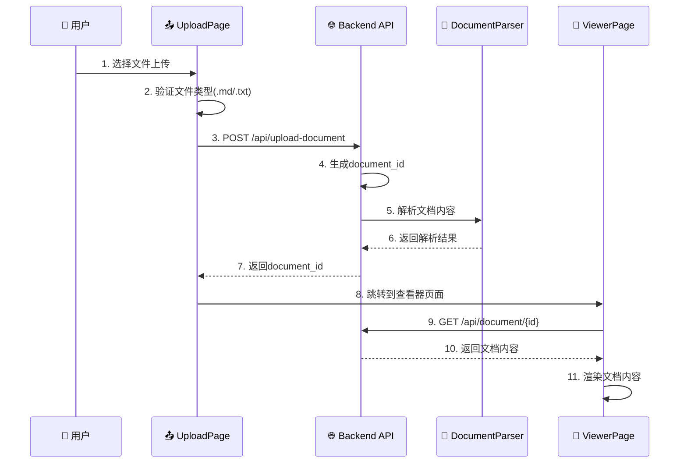
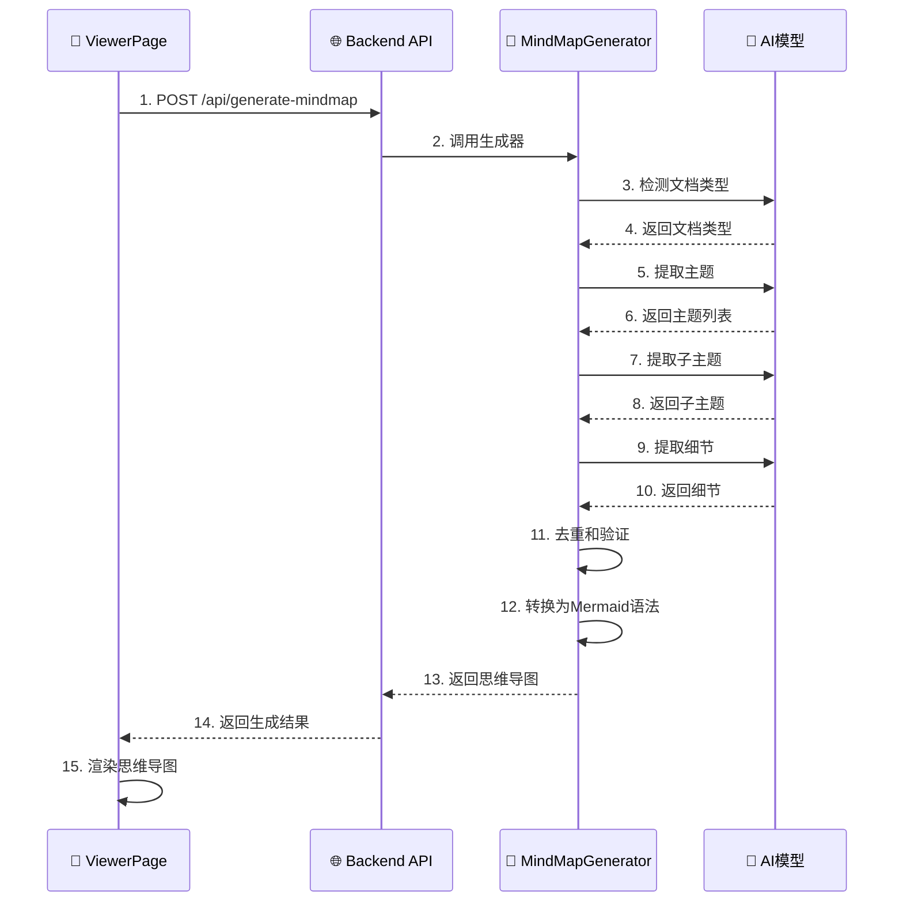
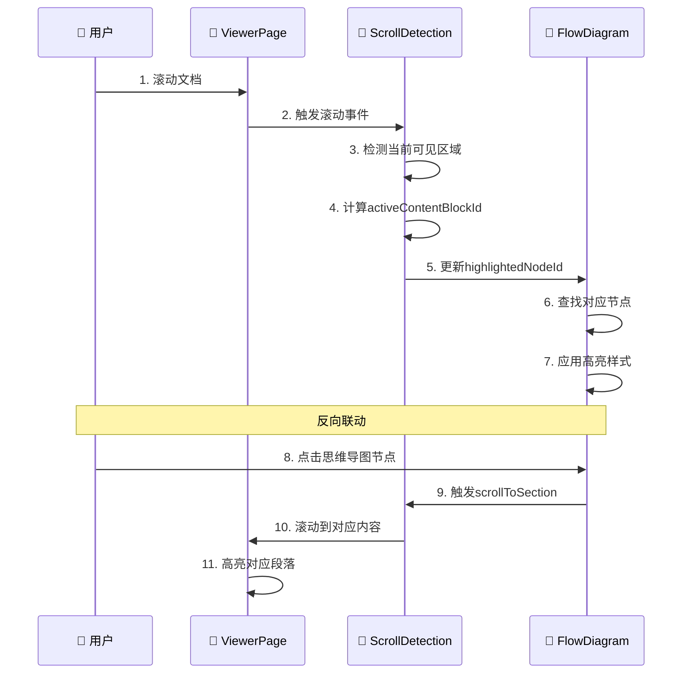

# 📚 AI辅助阅读器代码库完整学习文档

## 📋 文档概述

这是一个**AI辅助阅读器**项目的完整学习文档，采用**前后端分离架构**，基于**Python FastAPI + React**技术栈构建。项目主要功能是将文档内容转换为交互式思维导图，实现智能阅读和可视化分析。

---

## 🏗️ 第一部分：项目结构详解

### 📋 整体架构概览

**核心特性**：
- 🤖 **多AI模型支持**：DeepSeek、OpenAI GPT、Claude、Gemini等
- 📄 **多格式支持**：Markdown (.md)、文本 (.txt) 文件
- 🎨 **交互式可视化**：基于ReactFlow的高质量思维导图
- 🔄 **实时同步**：文档阅读与思维导图联动高亮
- 💻 **现代化界面**：React + Tailwind CSS响应式设计

### 📁 详细目录结构

```
mindmap-generator-main/
├── 📄 README.md                     # 项目说明文档
├── 📄 requirements-web.txt          # Python依赖包列表
├── 📄 .env.example                  # 环境变量模板
├── 📄 start_conda_web_app.py        # 🚀 一键启动脚本
├── 📄 web_backend.py                # 🌐 FastAPI后端服务器
├── 📄 mindmap_generator.py          # 🧠 AI思维导图生成核心
├── 📄 document_parser.py            # 📄 文档解析器
├── 📄 mindmap_test.py               # 🧪 测试文件
└── 📁 frontend/                     # ⚛️ React前端应用
    ├── 📄 package.json              # Node.js项目配置
    ├── 📄 tailwind.config.js        # Tailwind CSS配置
    ├── 📁 public/                   # 静态资源
    │   ├── 📄 index.html           # HTML入口
    │   └── 📄 favicon.ico          # 图标
    └── 📁 src/                      # 源代码目录
        ├── 📄 index.js             # React应用入口
        ├── 📄 App.js               # 主应用组件
        ├── 📄 index.css            # 全局样式
        ├── 📁 components/          # 组件目录
        │   ├── 📄 UploadPage.js    # 文档上传页面
        │   ├── 📄 ViewerPageRefactored.js  # 主查看器页面
        │   ├── 📄 FlowDiagram.js   # ReactFlow思维导图
        │   └── 📄 EditableNode.js  # 可编辑节点组件
        ├── 📁 hooks/               # 自定义Hook
        │   ├── 📄 useScrollDetection.js    # 滚动检测和联动
        │   ├── 📄 useMindmapGeneration.js  # 思维导图生成
        │   └── 📄 useDocumentViewer.js     # 文档查看器
        ├── 📁 utils/               # 工具函数
        │   ├── 📄 api.js           # API客户端
        │   └── 📄 dataConverter.js # 数据转换器
        └── 📁 contexts/            # React上下文
            └── 📄 AuthContext.js   # 认证上下文
```

---

## 🚀 第二部分：编译方式详解

### 🔧 环境要求

- **Python**: 3.8+ (推荐3.9+)
- **Node.js**: 16+ (推荐18+)
- **操作系统**: Windows 10/11, macOS 10.15+, Linux (Ubuntu 18.04+)

### 🎯 一键编译启动（推荐）

```bash
# 1. 克隆项目
git clone <your-repo-url>
cd mindmap-generator-main

# 2. 🔥 一键编译和启动
python start_conda_web_app.py
```

**自动化流程**：
1. ✅ 检查Python环境和Conda环境
2. ✅ 安装后端Python依赖 (`requirements-web.txt`)
3. ✅ 检查Node.js环境，自动安装npm依赖
4. ✅ 启动后端FastAPI服务（8000端口）
5. ✅ 编译并启动前端React服务（3000端口）
6. ✅ 自动打开浏览器 (`http://localhost:3000`)

### 🔗 手动分步编译

#### 后端编译
```bash
# 1. 安装Python依赖
pip install -r requirements-web.txt

# 2. 启动后端服务
python web_backend.py
```

#### 前端编译
```bash
# 1. 进入前端目录
cd frontend

# 2. 安装依赖
npm install

# 3. 开发模式启动
npm start

# 4. 生产构建
npm run build
```

---

## 🎯 第三部分：入口详解

### 🚀 启动入口：`start_conda_web_app.py`

```python
def main():
    """应用启动的真正入口"""
    # 🔍 1. 环境检查
    check_conda_env()
    install_requirements()
    
    # 🔄 2. 启动服务
    backend_process = start_backend()    # 8000端口
    frontend_process = start_frontend()  # 3000端口
    
    # 🌐 3. 自动打开浏览器
    open_browser("http://localhost:3000")
```

### 🌐 后端入口：`web_backend.py`

```python
# FastAPI应用实例
app = FastAPI(title="AI辅助阅读器 API", version="1.0.0")

# 🔑 核心API路由
@app.post("/api/upload-document")         # 文档上传
@app.post("/api/generate-mindmap")        # 思维导图生成
@app.get("/api/document/{document_id}")   # 文档获取
@app.get("/api/mindmap/{document_id}")    # 思维导图获取

# 启动服务器
if __name__ == "__main__":
    uvicorn.run(app, host="0.0.0.0", port=8000)
```

### ⚛️ 前端入口：`index.js` → `App.js`

```javascript
// index.js - React应用入口
import React from 'react';
import ReactDOM from 'react-dom/client';
import App from './App';

const root = ReactDOM.createRoot(document.getElementById('root'));
root.render(<App />);

// App.js - 主应用组件
function App() {
  return (
    <Router>
      <Routes>
        <Route path="/" element={<UploadPage />} />
        <Route path="/viewer" element={<ViewerPageRefactored />} />
      </Routes>
    </Router>
  );
}
```

---

## 🧠 第四部分：核心逻辑详解

### 🗺️ AI思维导图生成引擎

#### 核心类：`MindMapGenerator`

```python
class MindMapGenerator:
    """思维导图生成器 - 系统的AI核心"""
    
    async def generate_mindmap(self, document_content: str, request_id: str) -> str:
        """🔑 核心生成流程"""
        # 1️⃣ 文档类型检测
        doc_type = await self.detect_document_type(document_content, request_id)
        
        # 2️⃣ 提取主题 (支持大文档分块处理)
        topics = await self._extract_main_topics(document_content, topics_prompt, request_id)
        
        # 3️⃣ 批量相似性检查 (AI去重)
        filtered_topics = await self._batch_redundancy_check(topics, 'topic')
        
        # 4️⃣ 递归生成子主题和细节
        for topic in filtered_topics:
            subtopics = await self._extract_subtopics(topic, content, subtopics_prompt, request_id)
            for subtopic in subtopics:
                details = await self._extract_details(subtopic, content, details_prompt, request_id)
        
        # 5️⃣ 最终过滤和验证
        final_mindmap = await self.final_pass_filter_for_duplicative_content(mindmap_data)
        
        # 6️⃣ 转换为Mermaid语法
        return self._generate_mermaid_mindmap(final_mindmap)
```

### 🔄 前端状态管理核心

#### 1. **滚动联动系统：`useScrollDetection.js`**

```javascript
const useScrollDetection = (containerRef, documentId, currentMindmapMode, mermaidDiagramRef) => {
  // 🔑 双向联动状态
  const [activeContentBlockId, setActiveContentBlockId] = useState(null);
  const [highlightedNodeId, setHighlightedNodeId] = useState(null);
  
  // 🔑 正向联动：文档滚动 → 思维导图高亮
  const detectActiveSection = useCallback(() => {
    const sections = document.querySelectorAll('[data-block-id]');
    // 复杂的可视区域检测算法
    // 更新activeContentBlockId
    // 触发思维导图节点高亮
  }, []);
  
  // 🔑 反向联动：思维导图点击 → 文档滚动
  const scrollToSection = (item) => {
    const targetElement = document.querySelector(`[data-block-id="${item.id}"]`);
    if (targetElement) {
      targetElement.scrollIntoView({ behavior: 'smooth' });
    }
  };
};
```

#### 2. **ReactFlow集成：`FlowDiagram.js`**

```javascript
const FlowDiagram = ({ mindmapData, highlightedNodeId, onNodeClick }) => {
  // 🔑 节点变化处理 (解决高亮消失问题)
  const handleNodesChange = useCallback((changes) => {
    onNodesChange(changes);
    
    // 检测拖拽等变化，重新应用高亮
    const needsHighlightReapply = changes.some(change => 
      change.type === 'position' || change.type === 'dimensions'
    );
    
    if (needsHighlightReapply && highlightedNodeId) {
      setTimeout(() => {
        applyNodeHighlighting(highlightedNodeId);
      }, 150);
    }
  }, []);
  
  // 🔑 非破坏性高亮实现
  const applyNodeHighlighting = useCallback((nodeIdToHighlight) => {
    // 多策略节点查找
    // 直接DOM操作添加CSS类
    // 避免React状态冲突
  }, []);
};
```

---

## ⏱️ 第五部分：时序图详解

### 🔄 1. 文档上传和初始化流程



### 🧠 2. AI思维导图生成流程



### 🔄 3. 滚动联动高亮流程



---

## 🔧 第六部分：各个步骤关键实现函数

### 🧠 AI思维导图生成核心函数

#### 1. **主生成函数：`generate_mindmap()`**
```python
async def generate_mindmap(self, document_content: str, request_id: str) -> str:
    """🔑 核心生成流程 - 完整版"""
    # 文档类型检测
    doc_type = await self.detect_document_type(document_content, request_id)
    
    # 提取主题
    topics = await self._extract_main_topics(document_content, topics_prompt, request_id)
    
    # 批量相似性检查
    filtered_topics = await self._batch_redundancy_check(topics, 'topic')
    
    # 递归生成子主题和细节
    for topic in filtered_topics:
        subtopics = await self._extract_subtopics(topic, content, subtopics_prompt, request_id)
        
    # 最终过滤和验证
    final_mindmap = await self.final_pass_filter_for_duplicative_content(mindmap_data)
    
    # 转换为Mermaid语法
    return self._generate_mermaid_mindmap(final_mindmap)
```

#### 2. **AI模型统一接口：`DocumentOptimizer.generate_completion()`**
```python
async def generate_completion(self, prompt: str, max_tokens: int = 5000, request_id: str = None, task: str = None) -> str:
    """统一的AI模型调用接口"""
    if Config.API_PROVIDER == "CLAUDE":
        # Claude API调用
        async with self.anthropic_client.messages.stream(...) as stream:
            message = await stream.get_final_message()
            return message.content[0].text
    elif Config.API_PROVIDER == "OPENAI":
        # OpenAI API调用
        response = await self.openai_client.chat.completions.create(...)
        return response.choices[0].message.content
    elif Config.API_PROVIDER == "DEEPSEEK":
        # DeepSeek API调用
        response = await self.deepseek_client.chat.completions.create(...)
        return response.choices[0].message.content
    # ... 其他模型
```

### 🔄 前端核心函数

#### 1. **滚动联动核心：`useScrollDetection()`**
```javascript
const useScrollDetection = (containerRef, documentId, currentMindmapMode, mermaidDiagramRef) => {
  // 🔑 滚动检测和节点高亮
  const highlightMermaidNode = useCallback((nodeId) => {
    // 复杂的节点查找逻辑
    const selectors = [
      `[data-id="${nodeId}"]`,
      `#${nodeId}`,
      `[id*="${nodeId}"]`,
      `g[data-id="${nodeId}"]`
    ];
    
    // 多策略查找和高亮
    selectors.forEach(selector => {
      const nodes = document.querySelectorAll(selector);
      nodes.forEach(node => {
        if (!node.classList.contains('mermaid-highlighted-node')) {
          node.classList.add('mermaid-highlighted-node');
        }
      });
    });
  }, []);
  
  // 🔑 反向联动：思维导图到文档
  const scrollToSection = (item) => {
    const targetElement = document.querySelector(`[data-block-id="${item.id}"]`);
    if (targetElement) {
      targetElement.scrollIntoView({ behavior: 'smooth', block: 'center' });
    }
  };
};
```

#### 2. **ReactFlow集成核心：`FlowDiagram.js`**
```javascript
// 🔑 节点变化处理 (解决高亮消失问题)
const handleNodesChange = useCallback((changes) => {
  onNodesChange(changes);
  
  // 检测需要重新应用高亮的变化
  const needsHighlightReapply = changes.some(change => 
    change.type === 'position' || 
    change.type === 'dimensions' ||
    change.type === 'select'
  );
  
  if (needsHighlightReapply && highlightedNodeId) {
    setTimeout(() => {
      applyNodeHighlighting(highlightedNodeId);
    }, 150);
  }
}, []);

// 🔑 非破坏性高亮实现
const applyNodeHighlighting = useCallback((nodeIdToHighlight) => {
  // 多策略节点查找
  const strategies = [
    () => document.querySelector(`[data-id="${nodeIdToHighlight}"]`),
    () => document.querySelector(`#${nodeIdToHighlight}`),
    () => document.querySelector(`.react-flow__node[data-id="${nodeIdToHighlight}"]`)
  ];
  
  let foundElement = null;
  for (const strategy of strategies) {
    foundElement = strategy();
    if (foundElement) break;
  }
  
  if (foundElement) {
    foundElement.classList.add('highlighted-node');
  }
}, []);
```

### 🌐 API通信核心函数

#### 1. **文档处理API：`web_backend.py`**
```python
@app.post("/api/upload-document")
async def upload_document(file: UploadFile = File(...)):
    """文档上传和处理入口"""
    # 文件验证
    if not file.filename.endswith(('.md', '.txt')):
        raise HTTPException(status_code=400, detail="不支持的文件格式")
    
    # 生成文档ID
    document_id = hashlib.md5(f"{file.filename}{time.time()}".encode()).hexdigest()
    
    # 解析文档内容
    content = await file.read()
    parsed_content = DocumentParser.parse(content.decode('utf-8'))
    
    # 存储和返回
    store_document(document_id, parsed_content)
    return {"document_id": document_id, "status": "success"}

@app.post("/api/generate-mindmap")
async def generate_mindmap_endpoint(request: GenerateMindmapRequest):
    """思维导图生成API"""
    generator = MindMapGenerator()
    
    # 获取文档内容
    document = await get_document_by_id(request.document_id)
    
    # 生成思维导图
    mindmap_result = await generator.generate_mindmap(
        document['content'], 
        request.request_id
    )
    
    return {"mindmap": mindmap_result, "status": "completed"}
```

#### 2. **前端API客户端：`api.js`**
```javascript
// 文档上传
export const uploadDocument = async (file, onProgress) => {
  const formData = new FormData();
  formData.append('file', file);
  
  return await fetch('/api/upload-document', {
    method: 'POST',
    body: formData
  });
};

// 思维导图生成
export const generateMindmap = async (documentId, options = {}) => {
  const response = await fetch('/api/generate-mindmap', {
    method: 'POST',
    headers: {
      'Content-Type': 'application/json',
    },
    body: JSON.stringify({
      document_id: documentId,
      request_id: generateRequestId(),
      ...options
    })
  });
  
  return await response.json();
};

// 轮询状态
export const pollMindmapStatus = async (requestId) => {
  const response = await fetch(`/api/mindmap-status/${requestId}`);
  return await response.json();
};
```

---

## 🎯 总结

这个AI辅助阅读器是一个**复杂而精密的系统**，涉及：

### 🔑 核心技术栈
- **后端**: Python + FastAPI + 多AI模型集成
- **前端**: React + ReactFlow + Tailwind CSS
- **通信**: RESTful API + WebSocket (可选)
- **部署**: 一键启动脚本 + Docker支持

### 🧠 核心创新点
1. **AI驱动的智能分析**: 多模型支持，智能文档类型检测
2. **双向联动机制**: 文档滚动与思维导图高亮完美同步
3. **非破坏性高亮**: 解决React组件状态管理复杂性
4. **分块处理算法**: 支持大文档的高效处理
5. **成本追踪系统**: 完整的AI调用成本管理

### 🔄 系统特点
- **高度模块化**: 每个功能模块职责明确
- **错误处理完善**: 多层次异常处理和重试机制
- **性能优化**: 异步处理、批量操作、智能缓存
- **用户体验**: 实时反馈、进度提示、响应式设计

这个系统展示了**现代AI应用开发的最佳实践**，是学习AI集成、前端状态管理、后端API设计的优秀案例。

---

📝 **学习建议**：
1. 先理解整体架构和数据流
2. 重点关注AI生成逻辑和前端联动机制
3. 实践时可以从简单功能开始，逐步扩展
4. 注意异步处理和错误处理的实现细节

---

*文档生成时间：2024年12月*
*版本：v1.0* 