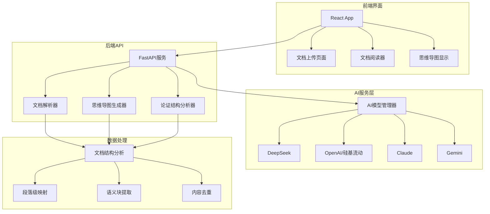

# 🧠 智能思维导图生成器

> 基于大语言模型的智能文档分析与思维导图生成系统

## 🎯 项目概述

这是一个现代化的智能思维导图生成器，能够自动分析文档内容并生成结构化的交互式思维导图。系统集成了多种大语言模型，采用前后端分离架构，提供优秀的用户体验。

### ✨ 核心特性

- 🤖 **多AI模型支持**：DeepSeek、OpenAI GPT、Claude、Gemini等主流模型
- 📄 **多格式支持**：Markdown (.md)、文本 (.txt) 文件，可扩展PDF支持  
- 🎨 **交互式可视化**：基于Mermaid.js的高质量思维导图
- ⚡ **异步处理**：文档上传后立即显示，思维导图异步生成
- 💻 **现代化界面**：React + Tailwind CSS响应式设计
- 📱 **移动端适配**：支持移动设备访问
- 🔄 **实时同步**：文档阅读与思维导图联动高亮
- 📊 **论证结构分析**：专门的学术文档论证逻辑分析
- 💾 **多种导出**：支持Markdown、Mermaid代码、HTML等格式
- 🔗 **在线编辑**：集成Mermaid Live Editor

## 🏗️ 系统架构

### 整体架构图



### 技术栈详解

#### 后端技术栈
- **FastAPI**: 现代异步Web框架，提供高性能API服务
- **Python 3.8+**: 核心开发语言
- **多AI模型集成**: 统一的AI接口抽象层
- **异步处理**: 支持并发请求和长时间运行的AI任务
- **文档解析**: 基于正则表达式的Markdown结构分析
- **智能去重**: 基于语义相似度的内容去重算法

#### 前端技术栈
- **React 18**: 现代前端框架，使用Hooks架构
- **Tailwind CSS**: 原子化CSS框架，响应式设计
- **Mermaid.js**: 强大的图表渲染引擎
- **React Router**: 单页应用路由管理
- **Axios**: HTTP客户端，处理API调用
- **React Hot Toast**: 优雅的通知系统

#### AI集成特性
- **多提供商支持**: 统一接口支持多种AI服务
- **成本控制**: 精确的token使用追踪和成本计算
- **智能重试**: 指数退避重试机制
- **错误恢复**: 多层次错误处理和优雅降级

## 📁 项目结构详解

```
mindmap-generator/
├── 📄 README.md                     # 项目说明文档
├── 📄 requirements-web.txt          # Python依赖包列表
├── 📄 .env.example                  # 环境变量模板
├── 📄 .gitignore                    # Git忽略文件配置
│
├── 🚀 核心后端文件
│   ├── 📄 mindmap_generator.py      # 核心思维导图生成引擎
│   ├── 📄 web_backend.py            # FastAPI后端API服务
│   ├── 📄 document_parser.py        # 文档结构解析器
│   └── 📄 start_conda_web_app.py    # 一键启动脚本
│
├── 🎨 前端React应用
│   ├── 📄 package.json              # Node.js依赖配置
│   ├── 📄 tailwind.config.js        # Tailwind CSS配置
│   ├── 📁 src/                      # 源代码目录
│   │   ├── 📄 App.js                # 主应用组件
│   │   ├── 📄 App.css               # 全局样式
│   │   ├── 📁 components/           # React组件
│   │   │   ├── 📄 UploadPage.js           # 文件上传页面
│   │   │   ├── 📄 ViewerPageRefactored.js # 文档查看器（重构版）
│   │   │   ├── 📄 MermaidDiagram.js       # 思维导图组件
│   │   │   ├── 📄 DocumentRenderer.js     # 文档渲染器
│   │   │   ├── 📄 PDFViewer.js            # PDF查看器

│   │   │   ├── 📄 TableOfContents.js      # 目录组件
│   │   │   └── 📄 ThemeToggle.js          # 暗黑模式切换
│   │   ├── 📁 contexts/             # React上下文
│   │   │   └── 📄 ThemeContext.js         # 主题上下文
│   │   └── 📁 hooks/                # 自定义React Hooks
│   │       ├── 📄 useDocumentViewer.js     # 文档查看器逻辑
│   │       ├── 📄 useMindmapGeneration.js  # 思维导图生成逻辑
│   │       ├── 📄 usePanelResize.js        # 面板调整逻辑

│   │       └── 📄 useScrollDetection.js    # 滚动检测与联动高亮
│   └── 📁 public/                   # 静态资源
│       ├── 📄 index.html            # HTML模板
│       ├── 📄 favicon.ico           # 网站图标
│       └── 📄 manifest.json         # PWA配置
│
├── 📁 存储目录
│   ├── 📁 uploads/                  # 用户上传文件存储
│   ├── 📁 mindmap_outputs/          # 思维导图输出文件
│   ├── 📁 pdf_outputs/              # PDF解析结果
│   └── 📁 api_responses/            # AI API响应日志（调试用）
│
├── 📁 文档和示例
│   ├── 📄 WEB应用使用说明.md         # Web应用使用指南
│   ├── 📄 Conda环境使用指南.md       # Conda环境配置指南
│   ├── 📄 思维导图生成器技术实现详解.md # 技术实现详细文档
│   ├── 📄 markdown.md               # Markdown示例文档
│   ├── 📄 sample_input_document_as_markdown__durnovo_memo.md
│   ├── 📄 sample_input_document_as_markdown__small.md
│   └── 📁 screenshots/              # 项目截图
│       ├── 📄 illustration.webp           # 功能演示图
│       ├── 📄 mindmap_outline_md_example_durnovo.webp
│       ├── 📄 mermaid_diagram_example_durnovo.webp
│       ├── 📄 logging_output_during_run.webp
│       ├── 📄 token_usage_report.webp
│       └── 📄 mindmap-architecture.svg
│
└── 📁 其他文件
    ├── 📄 package.json              # 根目录Node.js配置
    ├── 📄 package-lock.json         # 依赖锁定文件
    └── 📁 venv/                     # Python虚拟环境
```

## 🚀 快速开始

### 环境要求

- **Python**: 3.8 或更高版本
- **Node.js**: 16 或更高版本
- **Conda**: 推荐使用（可选）

### 🎯 一键启动（推荐）

```bash
# 克隆项目
git clone <your-repo-url>
cd mindmap-generator

# 配置环境变量
cp .env.example .env
# 编辑 .env 文件，添加你的API密钥

# 一键启动（自动安装依赖并启动服务）
python start_conda_web_app.py
```

启动脚本会自动：
- ✅ 检查并安装Python依赖
- ✅ 检查Node.js环境并安装前端依赖
- ✅ 启动后端FastAPI服务 (端口8000)
- ✅ 启动前端React开发服务器 (端口3000)
- ✅ 自动打开浏览器访问应用

### ⚙️ 环境变量配置

在 `.env` 文件中配置AI服务：

```env
# 选择AI提供商 (DEEPSEEK, OPENAI, CLAUDE, GEMINI)
API_PROVIDER=DEEPSEEK

# DeepSeek API（推荐，成本低廉）
DEEPSEEK_API_KEY=your_deepseek_api_key

# OpenAI API（推荐使用硅基流动）
OPENAI_API_KEY=your_openai_api_key
OPENAI_BASE_URL=https://api.siliconflow.cn/v1

# Claude API
ANTHROPIC_API_KEY=your_anthropic_api_key

# Gemini API
GEMINI_API_KEY=your_gemini_api_key
```

### 🔧 手动安装（可选）

如果需要手动安装：

```bash
# 1. 安装Python依赖
pip install -r requirements-web.txt

# 2. 安装前端依赖
cd frontend
npm install
cd ..

# 3. 启动后端服务
python -m uvicorn web_backend:app --host 0.0.0.0 --port 8000 --reload

# 4. 启动前端服务（新终端）
cd frontend
npm start
```

### 🌐 访问应用

- **前端界面**: http://localhost:3000
- **后端API**: http://localhost:8000  
- **API文档**: http://localhost:8000/docs

## 💡 使用指南

### 📤 上传文档

1. 访问首页，点击上传区域或拖拽文件
2. 支持 `.md` 和 `.txt` 格式文件
3. 文件上传后立即显示文档内容

### 📖 文档阅读

- **左侧面板**：文档内容，支持Markdown渲染
- **右侧面板**：思维导图和论证结构图
- **目录导航**：可折叠的文档结构目录
- **暗黑模式**：支持明暗主题切换

### 🧠 思维导图生成

1. 文档上传后，系统自动开始分析
2. **论证结构分析**：识别文档的逻辑论证流程
3. **语义块映射**：将文档段落映射到思维导图节点
4. **实时高亮**：阅读时自动高亮对应的思维导图节点

### 🔄 交互功能

- **节点点击**：点击思维导图节点跳转到对应文档段落
- **滚动联动**：文档滚动时自动高亮对应思维导图节点
- **面板调整**：可拖拽调整左右面板大小
- **导出功能**：支持下载Mermaid代码和Markdown文档


## 🔬 技术实现详解

### 🧮 AI模型管理

系统支持多种AI提供商，通过统一的接口抽象：

```python
class DocumentOptimizer:
    async def generate_completion(self, prompt: str, max_tokens: int, 
                                task: str) -> Optional[str]:
        # 根据API_PROVIDER选择对应的AI服务
        if Config.API_PROVIDER == "DEEPSEEK":
            return await self._call_deepseek(prompt, max_tokens)
        elif Config.API_PROVIDER == "OPENAI":
            return await self._call_openai(prompt, max_tokens)
        # ... 其他提供商
```

**支持的AI模型**：

| 提供商 | 模型 | 特点 | 成本 |
|--------|------|------|------|
| DeepSeek | deepseek-chat | 中文优化，推理能力强 | 极低 |
| OpenAI | gpt-4o-mini | 高质量输出，稳定性好 | 中等 |
| Claude | claude-3-5-haiku | 快速响应，理解能力强 | 中等 |
| Gemini | gemini-2.0-flash-lite | Google最新模型 | 低 |

### 📝 文档结构分析

采用基于Markdown标题的层级解析算法：

```python
class DocumentParser:
    def parse_document(self, markdown_text: str) -> DocumentNode:
        # 1. 提取所有标题
        headings = self._extract_headings(markdown_text)
        
        # 2. 构建层级树结构
        root = self._build_tree_structure(headings, markdown_text)
        
        # 3. 分配内容和计算范围
        self._post_process_tree(root, markdown_text)
        
        return root
```

**解析功能**：
- 自动识别Markdown标题层级
- 构建文档树形结构
- 生成可导航的目录
- 支持段落级精确定位

### 🔗 语义映射系统

实现文档段落与思维导图节点的智能映射：

```python
def updateDynamicMapping(chunks, mermaidCode, nodeMapping):
    # AI分析生成的语义块映射
    # 段落ID -> 节点ID 的映射关系
    # 支持一对多和多对一的复杂映射
```

**映射特性**：
- **段落级映射**：精确到每个文档段落
- **语义分组**：相关段落组合成逻辑节点
- **双向导航**：文档↔思维导图双向跳转
- **实时高亮**：滚动时自动同步高亮

### 🎨 思维导图渲染

基于Mermaid.js的高质量图表渲染：

```javascript
// 动态生成Mermaid语法
const mermaidCode = `
graph TD
    A[引言] --> B{核心论点}
    B --> C[支撑证据1]
    B --> D[支撑证据2]
    C --> E[结论]
    D --> E
`;

// 交互式渲染
<MermaidDiagram 
  code={mermaidCode}
  onNodeClick={handleNodeClick}
  ref={mermaidDiagramRef}
/>
```

**渲染特性**：
- **交互式节点**：支持点击跳转
- **动态高亮**：实时视觉反馈
- **自适应布局**：响应式设计
- **在线编辑**：集成Mermaid Live Editor

### ⚡ 异步处理架构

采用现代异步处理模式：

```python
# 后端异步任务管理
async def generate_argument_structure_async(document_id: str, content: str):
    try:
        # 更新状态为处理中
        document_status[document_id]['status_demo'] = 'generating'
        
        # AI分析处理（可能需要较长时间）
        result = await analyzer.generate_argument_structure(content)
        
        # 更新完成状态
        document_status[document_id]['status_demo'] = 'completed'
        document_status[document_id]['mermaid_code_demo'] = result['mermaid_string']
        
    except Exception as e:
        document_status[document_id]['status_demo'] = 'error'
```

**异步特性**：
- **非阻塞上传**：文档上传后立即可阅读
- **后台处理**：AI分析在后台异步进行  
- **实时状态**：前端轮询获取处理进度
- **优雅降级**：处理失败时的友好提示

## 🛠️ API接口文档

### 📤 文档上传
```http
POST /api/upload-document
Content-Type: multipart/form-data

{
  "file": "document.md"
}
```

**响应示例**：
```json
{
  "success": true,
  "document_id": "doc_abc123",
  "message": "文档上传成功",
  "content": "文档内容...",
  "parsed_content": "解析后的文档..."
}
```

### 🧠 生成论证结构
```http
POST /api/generate-argument-structure/{document_id}
```

**响应示例**：
```json
{
  "success": true,
  "status": "completed",
  "mermaid_code": "graph TD\n  A[引言] --> B[论点]...",
  "node_mappings": {
    "A": {
      "paragraph_ids": ["para-1", "para-2"],
      "semantic_role": "引言",
      "text_snippet": "文档开篇介绍了..."
    }
  }
}
```

### 📊 查询状态
```http
GET /api/document-status/{document_id}
```

### 📖 获取文档
```http
GET /api/document/{document_id}
```

### 🗂️ 获取文档结构  
```http
GET /api/document-structure/{document_id}
```

### 📚 获取目录
```http
GET /api/document-toc/{document_id}
```

完整的API文档请访问：http://localhost:8000/docs

## 🔧 高级配置

### AI模型优化

```env
# DeepSeek配置（推荐）
API_PROVIDER=DEEPSEEK
DEEPSEEK_API_KEY=your_key
DEEPSEEK_COMPLETION_MODEL=deepseek-chat  # 或 deepseek-reasoner

# OpenAI兼容配置（使用硅基流动等代理）
API_PROVIDER=OPENAI  
OPENAI_API_KEY=your_siliconflow_key
OPENAI_BASE_URL=https://api.siliconflow.cn/v1
OPENAI_COMPLETION_MODEL=gpt-4o-mini-2024-07-18
```

### 性能调优

```python
# 并发处理配置
MAX_CONCURRENT_REQUESTS = 5
REQUEST_TIMEOUT = 60
RETRY_ATTEMPTS = 3

# 缓存配置  
ENABLE_EMOJI_CACHE = True
CACHE_DIRECTORY = "./cache"

# 内容限制
MAX_CONTENT_LENGTH = 100000  # 字符
MAX_TOPICS = 8
MAX_SUBTOPICS_PER_TOPIC = 6
```

## 🐛 故障排除

### 常见问题

**1. 启动失败**
```bash
# 检查Python版本
python --version  # 应该 >= 3.8

# 检查Node.js版本
node --version   # 应该 >= 16

# 重新安装依赖
pip install -r requirements-web.txt --force-reinstall
```

**2. AI API调用失败**
```bash
# 检查环境变量
echo $API_PROVIDER
echo $DEEPSEEK_API_KEY

# 检查网络连接
curl -I https://api.deepseek.com

# 查看详细错误日志
tail -f api_responses/*.txt
```

**3. 前端编译错误**
```bash
# 清理缓存重新安装
cd frontend
rm -rf node_modules package-lock.json
npm install

# 检查端口占用
netstat -ano | findstr :3000  # Windows
lsof -ti:3000 | xargs kill    # macOS/Linux
```

**4. 思维导图不显示**
- 检查浏览器控制台错误
- 确认Mermaid代码格式正确
- 检查网络请求是否成功

### 调试模式

开启详细日志：

```python
# 在 web_backend.py 中
import logging
logging.basicConfig(level=logging.DEBUG)
```

查看AI API响应：
```bash
# 查看最新的API调用日志
ls -la api_responses/
cat api_responses/latest_response.txt
```

## 🤝 贡献指南

欢迎提交Issue和Pull Request！

### 开发环境设置

```bash
# 1. Fork仓库并克隆
git clone https://github.com/your-username/mindmap-generator.git
cd mindmap-generator

# 2. 创建开发分支
git checkout -b feature/your-feature-name

# 3. 设置开发环境
python -m venv venv
source venv/bin/activate  # Windows: venv\Scripts\activate
pip install -r requirements-web.txt

# 4. 前端开发环境
cd frontend  
npm install
npm start
```

### 代码规范

- **Python**: 遵循PEP 8规范
- **JavaScript**: 使用ES6+语法，遵循Airbnb风格
- **提交信息**: 使用约定式提交格式

### 测试流程

```bash
# 运行后端测试
python -m pytest tests/

# 运行前端测试  
cd frontend
npm test

# 端到端测试
npm run test:e2e
```

## 📄 许可证

本项目基于 [MIT许可证](LICENSE) 开源。

## 🙏 致谢

- [Mermaid.js](https://mermaid.js.org/) - 强大的图表渲染引擎
- [FastAPI](https://fastapi.tiangolo.com/) - 现代Python Web框架
- [React](https://react.dev/) - 优秀的前端框架
- [Tailwind CSS](https://tailwindcss.com/) - 实用的CSS框架
- [DeepSeek](https://www.deepseek.com/) - 高性能AI模型服务

## 📞 支持与反馈

- 📧 Email: [your-email@example.com]
- 🐛 Issues: [GitHub Issues](https://github.com/your-username/mindmap-generator/issues)
- 💬 讨论: [GitHub Discussions](https://github.com/your-username/mindmap-generator/discussions)

---

⭐ 如果这个项目对您有帮助，请给我们一个星标！
