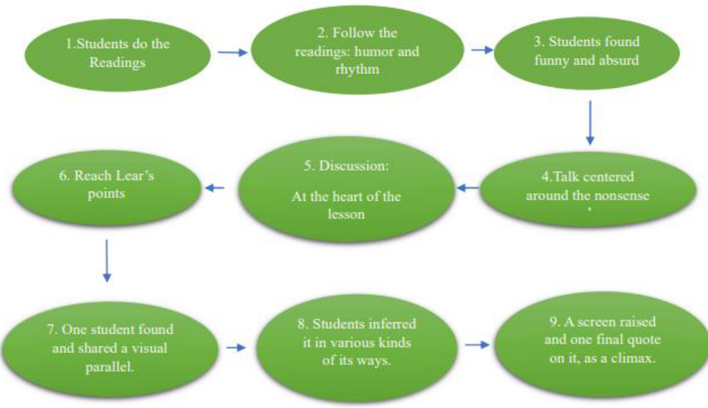
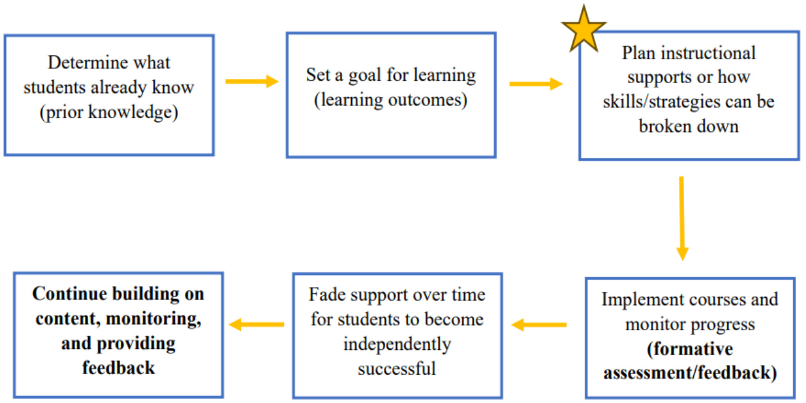

# Critical Thinking Pedagogics Design in an Era of ChatGPT and Other AI Tools — Shifting From Teaching “What” to Teaching “Why” and “How”

Yi Wu1

1 UC Berkeley, CA, USA Correspondence: Yi Wu, UC Berkeley, CA, USA.

Received: January 1, 2024   
doi:10.20849/jed.v8i1.1404

Accepted: January 25, 2024 Online Published: January 29, 2024 URL: https://doi.org/10.20849/jed.v8i1.1404

# Abstract

This paper explores the implications of integrating ChatGPT into educational paradigms, mainly focusing on critical thinking. With the advent of ChatGPT and its rapid evolution, educators face a dual-edged sword: an innovative tool for enhancing learning and a potential crutch that could hinder the development of critical thinking and analytical skills. This research delves into the historical context of art appreciation education, emphasizing the importance of critical thinking skills. It discusses the challenges and opportunities presented by ChatGPT in fostering an environment that encourages deep, reflective thought and intellectual engagement. By examining various methodologies in art appreciation, the paper highlights the transformative potential of incorporating AI into educational strategies while also addressing the crucial need for pedagogical adaptability and integrity in the ChatGPT era. Finally, the paper outlines the limitations and offers a nuanced perspective on the future of education, advocating for a balanced approach that leverages AI’s capabilities without compromising the development of independent, critical thought in students.

Keywords: ChatGPT, critical thinking, art appreciation, pedagogical strategies, artificial intelligence in education

# 1. Introduction

ChatGPT, a conversational AI developed using OpenAI’s generative pre-trained (GPT) language models, has rapidly gained recognition as an “around-the-clock educator,” revolutionizing perceptions of learning and teaching within six months of its introduction at the end of 2022 (Wu, 2023, paragraph 1).

The integration of ChatGPT into educational spheres has elicited a spectrum of responses characterized by acceptance and skepticism. Within the academic community, the adoption of this tool has been met with divergent stances. Certain educational establishments have prohibited its use, likening its application to acts of plagiarism in Jan 2023, but removed that ban after five months (Rosenblat, 2023, paragraphs 1 & 2). Junior Antonio Garcia, a student in the US, said ChatGPT has helped bring his grades from failing to as (Herron, 2023, paragraphs 12-14). The response within the University of California system, where my research is situated, remains indeterminate and contingent upon the discretion of individual educators. The range of responses spans from tolerance to endorsement and, in some instances, outright restriction. The nature of the course content notably influences this variability; there is a tendency for greater leniency in courses where ChatGPT’s capacity to provide direct answers is limited. Nonetheless, there is a nebulous and equivocal domain for courses in which ChatGPT can generate explicit responses, presenting a complex challenge in academic integrity and pedagogical approach.

The discourse on the role of this artificial intelligence tool in shaping the future of education echoes debates that trace back over two millennia, reminiscent of the philosophical inquiries of ancient Greek luminaries like Socrates (469-399 B.C.), Plato (427-347 B.C.), and Aristotle (384-322 B.C.). These philosophers explored the realms of knowledge acquisition and propagation. Does Socrates’ dialectic method, in which truth is discovered through peer discussions, still have a role in the learning process? Could the peer involved in this case be considered a chatbot (Wu, 2023, paragraph 1)? The emergence of ChatGPT has further clarified the purpose of education: Do we teach students “why” and “how” rather than “what”? As ChatGPT, the image creator Dall-e, and their strong competitors rapidly evolve to address the “what” more accurately and swiftly, the debate shifts from discussing the prohibition of large language models like ChatGPT in education to exploring how teaching methodologies must adapt.

In a policy analysis course, I worked as a teaching assistant and grader in the summer of 2023. The focus was on gradually training students to develop comprehensive analytical thinking and to produce high-quality policy recommendations, a skill crucial in the local and federal government in the United States. I observed that some student submissions appeared AI-generated in their reasoning and semantic expression, yet concrete evidence was lacking. Even after discussions with a student who subsequently reduced AI traces in their work, my suspicions remained. Conversations with fellow instructors about suspected ChatGPT use revealed divergent reactions, but two prevailing attitudes emerged: one, trust in students’ self-reporting (assuming honesty and no AI use), and two, recognizing that even if AI use hinders true mastery, the most significant harm is to the student, particularly at the graduate level. The consequence of dishonesty, albeit delayed, can manifest in professional shortcomings despite academic success.

With the upgrade to ChatGPT 4.0 in the fall of 2023, which enhanced capabilities and writing quality, I again noticed signs of students processing their work through ChatGPT in another course where I worked as a grader. This heightened my urgency for change. As educators and educational researchers, addressing the impact of ChatGPT on the educational sector is a crucial issue. Sub-questions might include:

Does using ChatGPT for assignments or papers considered plagiarism?   
What stance should educators take towards ChatGPT?   
Should educational institutions ban ChatGPT? Or to what extent ban it?   
Will ChatGPT encourage student laziness?   
Can ChatGPT replace educators? Or to what extent replace educators?   
Will ChatGPT create new educational inequities?   
Can academic dishonesty induced by ChatGPT hinder personal and societal development?   
How can educational goals be met when teachers cannot truly ascertain student comprehension while   
students finish their assignments with the help of ChatGPT?   
Can misinformation from ChatGPT mislead students, especially when teachers are unaware?   
Will the human brain degenerate because of artificial tools like ChatGPT?

Undoubtedly, the capacity to generate and collect information is a crucial skill, foundational to the thinking process, and a focal point of training in the initial stages of learning. This ability is of such importance in adult life that some argue that information asymmetry is a critical determinant of success in society, to the extent that many entrepreneurial ventures base their profit models on resolving “information asymmetry.” However, as we discussed above, in an era where platforms like ChatGPT, Microsoft, and various tech giants are creating content at an unprecedented pace, albeit perhaps overly optimistic, it is essential to raise a pertinent question: Should content creation still be one of the educational goals, particularly for university students who already possess a certain level of cognitive capability?

These questions bring me to the last century’s debate on academic rationalism and critical thinking skills imperative. Academic rationalism emphasizes subject-centered content knowledge, driven by the philosophy that there is a body of knowledge essential for all students to comprehend and understand. The rationale behind studying this body of knowledge is to make sense of the world and our purpose in it (Eisner, 1985). In contrast, a curriculum centered on critical thinking prioritizes skills like analysis, deduction, and decision-making based on an individual’s synthesized criteria, along with an understanding of the outcomes of these decisions. Such a curriculum is designed to foster the development of students’ decision-making capabilities, highlighting the importance of critical thinking in this process. The efficacy of making informed choices hinges on the student’s proficiency in processing, organizing, utilizing, and evaluating information and comprehending its context and significance. Essentially, the nature and quality of information initially received play a pivotal role in shaping any decision-making process (Anderson, 1990).

Such debate grows in the rich ground: Art Appreciation Course. In the rest of this paper, I will analyze the concept of critical thinking emphasized in art appreciation pedagogics design, examine its theoretical foundations, and explore how this critical approach to course design can address the challenges ChatGPT poses. Finally, I extrapolate and exemplify current applications of ChatGPT in education, concluding with an analysis of the limitations of my analysis and reflections on the future of education.

# 2. Critical Thinking Pedagogics Design in Art Appreciation Course

Since the advent of the 19th century, the landscape of art education has witnessed a significant evolution, marked by the emergence of pioneering methodologies in teaching art appreciation. This transformative period underscores the vital integration of critical thinking skills and the embracement of multicultural viewpoints within art education. In this segment, the design and implementation of three distinct art appreciation courses are examined to elucidate the operationalization of critical thinking within the curriculum and to expound upon its pivotal role. These illustrative cases signify a paradigmatic shift from traditional, passive learning modes to a more dynamic and interactive pedagogical approach. This approach fosters an environment conducive to critical inquiry. It enhances the student’s ability to engage with and appreciate the multifaceted nature of art, deeply rooted in its cultural, historical, and sociopolitical contexts. Through this lens, students are not merely passive recipients of knowledge but active participants in a discourse that bridges artistic interpretation with broader cultural and intellectual narratives, which is closer to the essence of the goals of education.

# 2.1 Critical Thinking in Art Appreciation from a Multicultural Perspective

Professor Candace Jesse Stout (1997) described her experience in the college art appreciation class, which left her with a profound impression. She highlighted the unique and dynamic teaching methods, focusing on appreciating art from a multicultural perspective and using interdisciplinary approaches that engage students deeply. Her experience in the art appreciation class revealed a pedagogically and philosophically unique approach to teaching. It demonstrated how an engaging and thought-provoking curriculum could make art appreciation relevant and insightful, bridging diverse perspectives and encouraging deep, critical thinking.

At the beginning of that semester, the class discussed Victorian Era nonsense verse, mainly focusing on works like Alice in Wonderland and The Jumblies by Edward Lear. These discussions led the students to explore the deeper meanings behind seemingly absurd texts. For instance, in The Jumblies, Lear’s humorous approach and the ridiculous imagery of the poem served as a starting point for discussing the often-overlooked human failing of not thinking things through thoroughly. The students engaged in critical discussions about the sense (or lack thereof) in Lear’s nonsense verse, identifying themes of thoughtlessness and superficiality. This led to a broader conversation about how people often fail to adequately assess problems or consider different perspectives before forming opinions or making decisions. The class realized that art, in various forms such as videos, poems, or paintings, often conceals deeper truths beneath a superficial layer, requiring careful analysis to uncover.

  
Figure 1. Curriculum design diagram

The detailed process was as follows:

1) Students were talking about Victorian Era nonsense verse. Among their readings were Alice in Wonderland and The Jumblies, part of a humorous prose and poetry genre that often combines the ridiculous with the truth.

2) In The Jumblies, poet and painter Edward Lear led these students down a zany path through the humor and rhythm of his words, only to leave them on the brink of a satirical truth at the end.

3) The students found all of this mildly funny and absurd.

4) Talk centered around the nonsense of the nonsense verse and the silliness of sailors in a sieve: “How could they...?” “Why didn’t they...?” “Didn’t they think...?”

5) The class had taken the hook, and discussion was pressed on to the heart of the lesson: Is there any sense in Lear’s nonsense verse? They probed and found a theme, identifying Lear’s voyagers as “thoughtless” and “shallow-minded.”

6) They had gotten at least one of Lear’s points: Often, people do not think, assess problems, or analyze situations. They neglect to weigh alternatives and consider all sides of a matter before forming opinions, making decisions, and acting.

7) One student found a visual parallel describing an MTV video that initially seemed ridiculous but made a point of more profound consideration.

8) From this, students inferred that many kinds—videos, poems, paintings—can tell the truth, but we have to work to find it. Often a first reading, observation, or listening reveals only the surface; deeper meaning comes from closer scrutiny. This was precisely what the teacher was after.

9) Finally, a screen was raised, and there, red-chalked on the board, were the words of Bertrand Russell: “Many people would sooner die than think. In fact, they do” (1993, p. 329). It was the climax of the lesson and a clue for just about everyone that thinking would be an integral theme in this freshman class.

A pivotal moment in the class came with the revelation of a quote by Bertrand Russell: “Many people would sooner die than think. They do.” This underscored the theme of critical thinking that would be central to the course. There are some main positive points we could think about. First, as Professor Stout pointed out, the instructor’s approach aligned with John Dewey’s educational philosophy, emphasizing teaching students how to think, not what to think. Beyond just studying principles of design and styles, the course took a unique approach by intertwining content and process in art appreciation. It emphasized the importance of critical thinking, encouraging students to deeply engage with and reflect on the ideas, concepts, and information presented. The instructor believed deep, reflective thinking must be nurtured while everyone can think.

Second, this instructor’s approach was distinctively multicultural, considering the context in which art is made and interpreted. This included considering students’ diverse backgrounds and experiences, the social and cultural context of the artists and their work, and the critical thinking process. This comprehensive approach aimed to foster multicultural awareness and understanding through what the author describes as “multicultural reasoning.”

Third, from this experience to broader implications, we could understand that the powerful idea central to modern educational philosophy is that learning is not a passive process where knowledge is transferred but rather a constructive activity. This concept, supported by the works of various educators and theorists (Bereiter & Scardamalia, 1989; Bruner, 1986; Langer, 1989; Paul, 1993; Resnick, 1987; Salomon, 1992; Wiggins, 1989), posits that students must actively engage in making sense of information themselves (Berthoff, 1981; Caine et al., 1994; Costa & Liebmann, 1995; Paul, 1993). This approach challenges the traditional view of students as passive recipients of pre-packaged knowledge, focusing instead on how they process and interpret content across all disciplines, including art.

Finally, we should acknowledge that learning is seen as a dynamic and intentional process where students employ metacognitive strategies to guide their thinking (Langer, 1989; Salomon & Globerson, 1987). This involves continual self-reflection and discussion about thinking processes, aiming to enhance the quality of their cognitive efforts (Paul, 1993). This methodology acknowledges that there are often many valid answers or perspectives to a problem, each evaluated based on how well they adhere to the standards of critical thinking. The emphasis is on understanding and creating meaning through individual thought processes rather than rote memorization or relying solely on external sources such as textbooks or instructors.

2.2 Different Artistic Elements and Historical Context Discussion in Art Appreciation Course

Why can students produce aesthetically pleasing art without fully understanding the elements that contribute to its quality? Art educators have encountered such a challenging realization in the past decades.

The Institute for Advanced Study of Art Appreciation at Ohio State University held the following appreciation course, sponsored by the National Foundation on the Arts and the Humanities. Attended by secondary art teachers from across the nation, the Institute focused on enhancing teaching methods in art appreciation, integrating both studio-oriented and appreciation-oriented approaches. These methods aimed to deepen students’ understanding of the unique qualities of visual art.

Reflecting on an innovative art appreciation program, Andrea Garson and Martin F. Russell (1967) emphasized the importance of active engagement in art. This engagement is crucial for students to develop their criteria for appreciating and interpreting artworks. One of the critical aspects of this approach was using discussion as the primary teaching method, supplemented by resources like Joshua C. Taylor’s Learning to Look and The Allied Arts, a High School Humanities Guide for Missouri. These resources gave students the necessary vocabulary and foundational knowledge to analyze art critically.

Through discussions on various artworks, students explored different artistic elements such as line, shape, color, texture, and expressive content. They delved into the works of diverse artists, examining the emotional and aesthetic effects of their visual organization. A pivotal program element was the in-depth study of Picasso’s Guernica, where students analyzed its historical context and artistic elements, such as color, value distribution, and symbolism. This study stood out as a testament to the program’s success, evidenced by the student’s active participation and insightful observations.

The program also made effective use of films to introduce concepts like color theory and the historical context of art. These visual aids bridged technical concepts with practical examples, enhancing students’ understanding. Additionally, studio activities comprised about a third of the class time and allowed students to express themselves visually. These activities were creative outlets and practical applications of the aesthetic evaluation criteria learned in class.

The program’s success is perhaps best encapsulated by the feedback from a student’s mother, who noted the broadening of her daughter’s perspective on art. This response suggests that the program’s critical thinking approach to art appreciation heightened students’ enjoyment of art and expanded their understanding significantly. It becomes evident that for many students, creating art alone is insufficient. A deeper, more analytical engagement with art, fostered by a critical thinking approach, can profoundly enrich their appreciation and understanding of art.

This approach to art education, emphasizing critical thinking and active engagement, has broader implications beyond art appreciation. It illustrates a powerful educational paradigm where the focus shifts from mere knowledge acquisition to developing critical analysis and interpretive skills. This paradigm is applicable across various disciplines, fostering a more holistic and inquisitive approach to learning. Similar methods can be implemented in subjects like history, literature, and science to encourage students to question, analyze, and synthesize information rather than passively absorbing it. For instance, in a literature class, students might be encouraged to critically assess themes and character development, while in science, they could engage in discussions about the implications of scientific discoveries or the ethical considerations in experimentation.

Moreover, the success of this art appreciation program in enhancing students’ understanding and enjoyment points to the importance of personalized and contextual learning. Tailoring education to address students’ diverse needs and backgrounds can significantly enhance their engagement and learning outcomes. In a globalized world, such educational practices are vital for preparing students to think critically and adaptively, equipping them with the skills necessary to navigate complex, multifaceted issues. This approach also fosters empathy and cultural awareness, as students learn to appreciate and analyze perspectives different from their own. Ultimately, the goal is to cultivate knowledgeable individuals and thoughtful, well-rounded citizens who can contribute meaningfully to a diverse and ever-changing world.

# 2.3 Enhancing Art Appreciation Through Critical Thinking and Micro-Writing

Candace Jesse Stout (1992) explores the integration of writing exercises in art appreciation courses to enhance critical thinking skills, drawing from her six semesters of developing writing exercises for college art appreciation, is grounded in the educational theories of Writing Across the Curriculum and the Critical Thinking Movement in North America.

Stout argues that while art discussion (“art talk”) is valuable, it has limitations in fostering deep, personal engagement with art. She suggests that as a pedagogical tool, writing offers a more effective avenue for students to engage and personally invest in art appreciation critically. Writing helps students articulate their silent, often subconscious, experiences with art, as noted by thinkers like Dewey, Langer, and Sontag. It provides a means to access and express the nonlinguistic, abstract nature of visual arts appreciation, as demonstrated by the works of artists like Helen Frankenthaler and Caspar David Friedrich.

Table 1. Examples of Critical Thinking Design in the Writing Curriculum   

<html><body><table><tr><td>Exercise</td><td>Critical Process</td><td>Thinking</td><td>Fundamental Issues</td><td>Artworks</td></tr><tr><td>Classification</td><td>Thinking independently; Thinking omarively</td><td>Geiking prelie bou</td><td>What is "style" in the visual arts? Why classify artworks into styles? Wassifi atiion? some criteria for</td><td>I and the Village, Marc Chagall, 1911 One (#31), Jackson Pih of Venus, Sandroo Barth and en, Ma</td></tr><tr><td>Clustering</td><td>Exploring feelings thoughts; thinking</td><td>thoughts underlying feelings and underlying Thinking precisely about</td><td>How do we respond to art? What role do our emotions play in our response? What role does our intellect play in our response? Can we separate the degree to which expressive and formal properties influence our response?</td><td>Rothko, 1955 Student's Choice</td></tr><tr><td>Examining Multiple Perspectives</td><td>Reasoning or theories</td><td>dialogically: coe pe specive,</td><td>Why study art? What is "art?" How can we define it? How should art function in our daily lives? What is the role of the artist in society?</td><td>Paired Artists: Hemente Oro Ee Munch /Pierre-Auguste Renoir Vincent Van Gogh/Ludwig Mies van der Rohe</td></tr><tr><td>Analogies</td><td>Thinking precisely about thinking; Comparing situations; new contexts; Clarifying conclusions, or beliefs; Exploring implications</td><td>analogous Transferring insights to What is the role of art in society? issues,</td><td></td><td>Student's choice</td></tr></table></body></html>

The exercises that follow vary in level of difficulty and in recommended placement within the semester’s or the year’s curriculum. Some activities can be used at the beginning of the course; others require the development of preliminary concepts, content understanding, or skills (Stout, 1992).

Stout underscores the limitations of classroom dialogue, such as the lack of opportunity for all students to participate and the extemporaneous nature of speaking that may not allow deep processing of thoughts. In contrast, writing facilitates deeper cognitive processing and independent thought, enabling students to explore their perceptions and understandings of the artfully. Stout describes various “micro-writing” activities designed for art appreciation courses. These short writing tasks range from analogies and narrative paragraphs to more extended essays to enhance critical thinking and understanding of art. The exercises encourage students to think independently, compare artworks, and reflect critically on their perceptions, aligning with critical thinking skills outlined by Richard Paul and the intellectual development stages proposed by William G. Perry.

She concludes by emphasizing the importance of discipline and critical thinking in art appreciation. Stout argues that writing in art education generates content and engages students’ thinking, allowing them to digest and critically analyze the subject matter. This approach moves students from passive receivers of information to active participants in their learning process, shaping their understanding and appreciation of art.

# 3. Why Critical Thinking Pedagogics Design in Art Appreciation Is implacable in the ChatGPT Era?

To discuss the application of critical thinking in art appreciation courses, as well as the insights it offers for pedagogical methodologies in the era of ChatGPT, it is essential to revisit constructivism in the field of education.

# 3.1 Constructivism and Scaffolding Theory

Constructivism, pioneered by Jean Piaget (1896-1980), views learning as an active process of knowledge construction. According to this theory, learners are seen as active participants who construct meaning and knowledge through their interactions with the world. In this approach, the teacher is a facilitator or guide who supports learners’ active engagement and exploration. Constructivism aims to foster deep understanding, critical thinking, and the ability to apply knowledge in real-world contexts (Wu, 2023).

The term “Scaffolding,” conceptualized by another socio-constructivist, Jerome Bruner, in the 1970s, is based upon and mirrors the foundational principles of Lev Vygotsky’s “Zone of Proximal Development.” This theoretical framework is inherently aligned with the broader tenets of socio-constructivism, which posits that individuals construct meaning through interpersonal interactions.

The scaffolding theory posits that when children learn new concepts, they necessitate proactive support from teachers or other adults. Initially, they are dependent on this adult assistance. However, gradually, as they progress in their thinking processes and acquire new skills and knowledge, they become increasingly autonomous, leading to a corresponding diminishment of the support provided. This dynamic between adults and children in learning activities and structures analogously reflects the external scaffolding structures in construction.

Similarly, just as scaffolding is dismantled upon the completion of a construction project, the pedagogical scaffolding provided by teachers to young learners is characterized by its temporary support and eventual removal. More specifically, scaffolding techniques reduce the many choices a young learner may face, eventually focusing on acquiring pertinent knowledge and skills.

In his scaffolding theory, Bruner emphasized that students are not passive recipients of knowledge but active information processors. If knowledge is conceptualized as a staircase, students prefer not to be carried to a step but rather appreciate guidance to ascend a step themselves or to be provided with a crutch to aid in stepping up. The “protracted struggles,” the “grass,” the “stone,” the “potted plant,” and all the initially misunderstood or bewildering elements are resolved through their efforts, influenced by the teacher’s instructional methods and with the aid of necessary learning materials. This experience constitutes what they perceive as authentic learning. They value the process of exploration more than its results. Engaging students from a stance of equality and influence rather than from a position of authoritative instruction yields significantly better outcomes.

The concept of “Scaffolding” offers a profound framework for understanding the role and potential of artificial intelligence, particularly ChatGPT, in educational settings. Scaffolding in education refers to the temporary support given to students to help them achieve higher levels of understanding and skill acquisition. This support gradually diminishes as students become more proficient, mirroring removing scaffolding from a building once it becomes structurally sound. ChatGPT, with its advanced language processing capabilities, aligns seamlessly with this educational concept, acting as a digital scaffold that supports and enhances learning experiences.

  
Figure 2. How to use ChatGPT as “scaffolding” in the curriculum design

“Plan instructional supports or how skills/strategies can be broken down” is a crucial step in this design, which needs to be re-planed in the ChatGPT era.

# 3.2 ChatGPT as Digital Scaffolding

ChatGPT can provide immediate, tailored assistance to students. In a classroom setting, teachers might not always be available to offer one-on-one help to every student. ChatGPT can fill this gap by offering personalized support and feedback, ensuring that each student receives the attention necessary to understand complex concepts. This individualized assistance is a cornerstone of scaffolding, helping students progress at their own pace and according to their unique learning needs.

Furthermore, ChatGPT can adapt its level of support based on the student’s responses. For beginners in a subject, it can simplify explanations, break down concepts into more manageable parts, and provide basic examples. ChatGPT can introduce more complex ideas as students advance, challenge them with higher-level questions, and encourage deeper thinking. This adaptive nature of ChatGPT aligns with the principle of gradually reducing scaffolding as learners become more competent.

Another significant advantage of using ChatGPT as a scaffolding tool is its accessibility. It can be accessed anytime and anywhere, providing continuous learning opportunities outside the classroom. This 24/7 availability allows students to seek help when needed, facilitating learning not confined to school hours. This constant availability helps maintain the learning momentum, which is crucial for building and solidifying new knowledge and skills.

Acting as a form of digital scaffolding, incorporating ChatGPT into the constructivist framework provides a novel perspective on pedagogical methodologies: enhancing learning experiences by offering immediate and tailored assistance. In scenarios where teachers cannot provide one-on-one support to every student, ChatGPT fills this gap, ensuring personalized attention and understanding of complex concepts. This individualized assistance, a cornerstone of scaffolding, allows students to progress at their own pace and according to their learning needs. Using ChatGPT as a scaffolding tool, educators can foster a dynamic learning environment, emphasizing the learning process as much as its outcomes, thereby cultivating critical thinkers adept at applying their knowledge in various contexts.

# 3.3 Teaching “Why” and “How” Instead of “What”

ChatGPT’s capability to convey information and knowledge efficiently addresses the aspect of teaching “what” to students. This progression necessitates a corresponding shift in the role of educators, pivoting towards a more focused emphasis on teaching “why” and “how.” This shift underlines the critical importance of a Critical Thinking Pedagogics Design in modern educational settings.

Constructivism, as proposed by Jean Piaget, views learning as an active process where knowledge is constructed through interactions with the world. This philosophy positions the teacher as a facilitator or guide rather than a direct provider of knowledge. In this framework, the role of ChatGPT can be seen as complementary. By handling the foundational aspects of teaching “what” — that is, the basic facts, theories, and concepts of various subjects — ChatGPT frees educators to delve deeper into the “why” and “how” aspects of learning.

This deeper exploration is where Critical Thinking Pedagogics Design plays a pivotal role. Critical thinking involves understanding information and analyzing, synthesizing, and evaluating it. Educators can utilize the time and space afforded by AI tools like ChatGPT to cultivate these higher-order thinking skills in students. They can design curricula and learning experiences that challenge students to question underlying principles, understand the rationale behind concepts, and apply their knowledge in diverse and real-world contexts.

In art appreciation courses, for instance, while ChatGPT can provide historical facts, artist information, and technique descriptions — the “what” — educators can guide students to explore the “why” behind an artist’s work and the “how” of its impact on society and culture. This approach encourages students to think critically about art, going beyond surface-level understanding to a deeper appreciation and analysis.

Furthermore, the concept of “Scaffolding” finds new relevance in this context. ChatGPT can be seen as a form of digital scaffolding, providing initial support and information to students. As students progress, this scaffolding can be gradually removed, with educators stepping in to guide students through more complex, abstract thinking and application processes. This gradual shift from AI-assisted learning to educator-guided exploration aligns perfectly with the goals of Critical Thinking Pedagogics Design.

Additionally, the accessibility and adaptability of ChatGPT as a learning tool ensure that it can cater to diverse learning styles and needs, further reinforcing the constructivist approach to education. This individualization ensures that all students can lay a solid foundation of knowledge to build their critical thinking skills.

In conclusion, integrating AI tools like ChatGPT in education represents a significant evolution in teaching methodologies. While these tools can effectively cover the “what” of learning, educators must adapt their goals and methods to focus more on the “why” and “how.” Critical Thinking Pedagogics Design becomes crucial in this scenario, ensuring that students accumulate knowledge and develop the skills to analyze, question, and apply this knowledge thoughtfully and creatively. This shift heralds a new era in education, one that balances the acquisition of knowledge with the cultivation of deep, analytical, and critical thinking skills.

# 4. Limitations and Discussion

The very essence of critical thinking pedagogy, which emphasizes deep analytical skills and independent thought, encounters challenges and opportunities in the face of rapidly evolving AI technologies.

A major limitation in integrating AI tools like ChatGPT within critical thinking pedagogics is the potential risk of undermining the development of independent thinking skills. While ChatGPT can offer information and assist in learning processes, there is a danger that students might become overly reliant on AI for generating ideas and solutions, thereby stifling their creative and analytical development. This reliance can lead to a superficial engagement with learning materials, where the depth and rigor required for critical thinking are compromised.

Furthermore, the nature of AI-generated content challenges the development of critical thinking skills. By their current design, AI tools tend to provide straightforward answers and solutions, which might not always encourage the depth of inquiry and skepticism fundamental to critical thinking. This could lead to a passive learning attitude where students accept information without questioning its validity or exploring alternative perspectives.

Navigating the integration of AI tools like ChatGPT in education, especially in fostering critical thinking, requires a careful and deliberate approach. Educators must recognize the value of AI as a tool for providing information and assisting in certain aspects of learning. They must also remain vigilant to ensure that it does not replace the crucial human elements of teaching and learning — particularly the development of critical thought and the cultivation of intellectual curiosity.

One approach is to use AI as a starting point or a supplement in learning activities rather than the central or sole source of information. This approach can encourage students to use AI tools to gather initial ideas or data but then critically analyze, question, and build upon that information through their reasoning and research.

Additionally, there is a need to develop pedagogical strategies that explicitly focus on critical thinking skills in the presence of AI tools. This could involve creating learning activities that require students to critically evaluate AI-generated content, identify biases or limitations in the information provided by AI, and compare it with

human-generated analyses and perspectives.

Moreover, educators can play a pivotal role in modeling critical thinking skills and demonstrating how to integrate AI tools into this process effectively. By engaging in and guiding thoughtful discussions, debates, and analytical exercises, educators can show students how to use AI as a resource while maintaining a critical and questioning mindset.

Finally, addressing the challenges posed by AI in education necessitates ongoing research and dialogue among educators, technologists, and policymakers. This collaboration can lead to developing guidelines and strategies that optimize the benefits of AI in education while safeguarding against its potential pitfalls, particularly in the realm of critical thinking education.

While integrating ChatGPT and other AI tools in education presents certain limitations, particularly in the context of critical thinking pedagogy, it also offers opportunities for innovative educational approaches. The key lies in using AI to augment, rather than replace, the human-driven learning and intellectual development processes. Through careful planning, critical engagement, and thoughtful pedagogical strategies, it is possible to navigate these challenges and harness the potential of AI to enhance the educational experience.

# References

Anderson, T. (1990). Attaining Critical Appreciation Through Art. Studies in Art Education, 31(3), 132-140. National Art Education Association. Retrieved from https://www.jstor.org/stable/1320760   
Garson, A., & Russell, M. F. (1967). Two Alternative Approaches to Teaching Art Appreciation. Art Education, 20(6), 8-14. National Art Education Association.   
Herron, D. (2023, May 16). Some Austin-area school districts have banned ChatGPT while others are incorporating the AI chatbot. KVUE. Retrieved Dec 31, 2023, from https://www.kvue.com/article/news/education/schools/austin-schools-chatgpt/269-b1ddb10d-63ce-41b5-ab4 b-e1676d9bb049   
Rosenblatt, K. (2023, May 18). New York City public schools remove ChatGPT ban. NBC News. Retrieved Dec 31, 2023, from https://www.nbcnews.com/tech/chatgpt-ban-dropped-new-york-city-public-schools-rcna85089   
Stout, C. J. (1992). Critical Thinking and Micro-Writing in Art Appreciation. Visual Arts Research, 18(1), 57-71. University of Illinois Press. Retrieved from https://www.jstor.org/stable/20715769   
Stout, C. J. (1997). Multicultural Reasoning and The Appreciation of Art. Studies in Art Education, 38(2), 96-111. National Art Education Association. Retrieved from https://www.jstor.org/stable/1320586   
Wu, Y. (2023). Integrating Generative AI in Education: How ChatGPT Brings Challenges for Future Learning and Teaching. Journal of Advanced Research in Education, 2(4), 6-10. https://doi.org/10.56397/JARE.2023.07.02

# Copyrights

Copyright for this article is retained by the author(s), with first publication rights granted to the journal.

This is an open-access article distributed under the terms and conditions of the Creative Commons Attribution license (http://creativecommons.org/licenses/by/4.0/).