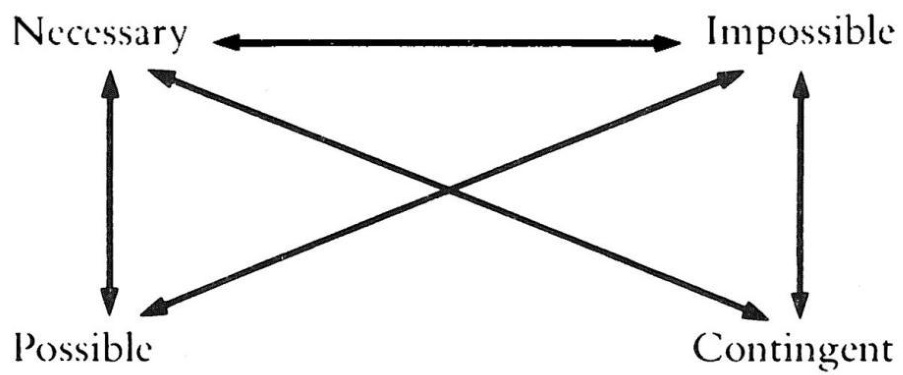
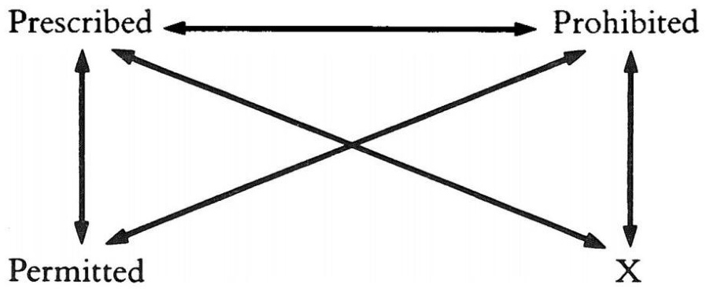

写在前面：

本文是对 For they know not what they do 第五章第一节“Why Should a Dialectician Learn toCount to Four?”（P179-197）重新翻译。译者水平有限，故欢迎并希望读者指出其中不通顺与不理解地方并提出修改建议，先行感谢。

蓝色部分是翻译有待进一步改进的地方。斜体为原文所加，而深蓝色加粗的斜体省略号用以表示在本译文所略去未翻的文段（别问为什么不翻全，问就是懒[滑稽]）。术语对照表如下：

用语对照表  

<html><body><table><tr><td>actual</td><td>实际的</td></tr><tr><td>virtual</td><td>虚拟的</td></tr><tr><td>real</td><td>真实的</td></tr><tr><td>reality</td><td>现实</td></tr><tr><td>the real</td><td>真实、实在界</td></tr><tr><td>realization</td><td>实现</td></tr><tr><td>actualization</td><td>实际化</td></tr><tr><td>the symbolic</td><td>象征界、符号界</td></tr><tr><td>the imaginary</td><td>想象界</td></tr><tr><td>viewpoint</td><td>视点</td></tr><tr><td>normal</td><td>常态的</td></tr><tr><td>normality</td><td>常态</td></tr><tr><td>inversion</td><td>颠倒、倒置、反转</td></tr><tr><td>image</td><td>像、形象</td></tr><tr><td>reflexion</td><td>反射、反映（德古：折返、反思）</td></tr><tr><td>moment</td><td>环节 （德古梗)</td></tr><tr><td>excess</td><td>溢出/过剩</td></tr><tr><td>gap</td><td>裂隙</td></tr><tr><td>reduce</td><td>缩减</td></tr></table></body></html>

译者：Cicada

# 为什么一位辩证学家应该学着数到四？

三元组/三位一体与其溢出/过剩——新教、雅各宾主义……与其他“消失的中介者”—“你手指的一敲”……— 为什么真理总是政治性的？

·三元组/三位一体与其溢出/过剩

一位黑格尔派的辩证学家必须学着数到多少呢？大多数黑格尔的解释者，更不用说他的批评者，都试图一致地说服我们，正确的答案是：到三（辩证的三元组[the dialectical triad]，等等）。此外，他们还互相争夺谁能更有说服力地唤起我们对“第四方”的注意。这个第四方就是不可辩证的溢出/过剩，是死亡之处所（… ）。据说它逃离辩证法的掌握，尽管（或者更准确地说，因为）它是辩证法运动的内在可能性条件：在其结果（Result）中不能被扬弃[aufgehoben]、不能重新被收入的（re-collected）纯支出性的否定性。

不幸的是，按照这种对黑格尔的批评的惯常，那黑格尔在此的问题与希区柯克的电影《哈里》中的同名主人公的问题一样：他不那么容易地同意他的葬礼——仔细一看，以下情形很快就会变得显而易见：批评家从他们的帽子中得出的所谓毁灭性的责难实际上构成了辩证运动本身的关键方面。也就是说，细心的读者不仅会立即想起许多特殊的案例，像“主观逻辑”第一部分中的四种判断，而且还会想起这一事实——黑格尔将辩证法运动本身所特有的四重结构（quadruplicity）主题化了：在最终的结果（Result）中，那不复存在、变得不可见的自相关否定性的纯粹虚无的溢出/过剩（the excess of the pure nothingness ofself-relating negativity）。在《逻辑学》的最后一章关于辩证过程的基本矩阵中，他指出，随着主体作为“什么都不算（counts for nothing）”的多余环节（thesurplus-moment），这一过程的环节可以数到三或四。

在方法的这个转折点上，认识过程同时返回到自身去了。这个否定性作为自身扬弃着的（self-sublating）矛盾，是第一个直接性与简单普遍性的恢复；因为他者的他者、否定的否定，直接就是肯定（the positive）、同一（theidentical）、普遍（the universal）。如果有人坚持去数的话，这第二个直接之物（this second immediate），在作为整体的方法之过程中，相对于第一个直接之物（the first immediate）和受中介之物（the mediated），就是第三项。然而，它相对于第一个或形式的否定（the first or formal negative）与绝对的否定性或第二个否定来说，也是第三项；现在，由于第一个否定已经是第二项，被数作第三的项也可以数作第四，而抽象形式也可以被当作一个四重结构（quadruplicity），而不是三重结构（triplicity）；否定（the negative）或差异，便数作两重（duality）。1

译者根据所引用英译的翻译

在法的这个转折点上，认识过程又刻转回到自身去了。这个否定性，作为自身扬弃的矛盾，是第一个直接性、即单纯普遍性之恢复；因为他物的他物、否定的否定，直接就是肯定的、同一的，普遍的。这第二个直接的东西，在整个过程中，\*假如人们总是愿意计数的话，对第一个直接的东西和对有中介的东西说，就是第三个东西。但它对第一个或说形式的否定对绝对的否定性或说第二个否定来说，也是第三个；如果那第一一个否定已经是第二项，那末，那被数为第三的，也可以数作第四；\*抽象的形式也将不用三分法而被当作是一个四分法。否定的东西或区别，以这种方式，便数作两分。一一第三个或第四个总是第一个和第二个环节，即直接—《大逻辑（下）》杨一之译本 P544

第一个环节是起始点的直接肯定性（the immediate positivity of the startingpoint）；第二个环节，其中介，并非仅仅是其直接的反面、外在的对立面——它就出现在我们努力去把握第一个环节、直接之物（the immediate）、自在自为（inand for itself）、本身（as such）之时：通过这种方式，我们已经将其中介（mediatize），而它不知不觉中变成了自己的对立面。第二个环节因此不是第一个环节的否定（the negative），不是其他异性（otherness）；它作为第一个环节自己的他者、自身的否定（the negative），就是第一个环节：一旦我们构想这个抽象-直接的起始点（一旦我们规定其预设和含意的具体网络、阐释其内容），它就转变为它自己的对立面。甚至在最抽象的层次上，“无”也不是“有”的外在对立：我们仅仅是通过尝试对“有”这一概念进行具体说明与规定就到达了“无”。“内在否定性”这一基本的辩证思想：一个实体（entity）被否定、消逝进入（pass over into）其作为其本身潜能之发展的对立面。

… 这就是否定性必须被数两次的原因。为了在实际上否定其起始点，我们必须否定它自己的“内在否定（negation）”——在其内在否定中，它的内容成为了它的“真相”（法西斯主义虽然反对自由主义资本主义，但也不是它实际上的否定（negation）而仅仅是其“内部的”否定（negation）：因此，为了实际上否定自由主义资本主义，我们必须否定它的这个否定（negation））。这一第二个否定、自相关的（self-relating negation）否定或（如黑格尔会说的）反射进自身的他异性，是绝对否定性和“纯粹差异”的消失的点/没影点（vanishing point）——这一自相矛盾的环节就是第三个环节，因为它已经是消逝进它自己之他者的第一个环节。我们在这里所得到的东西也可以被概念化为一个回溯性决定（retroactive determination）的案例：当反对其彻底的否定（Negative）时，第一个环节本身回溯性地转变为其对立面。自在的资本主义（capitalism-in-itself）并不等同于反对共产主义的资本主义（capitalism-as-opposed-to-Communism）：当面对其解体的趋势时，资本主义如果要生存，就不得不“从内部（from within）”否定自己（进入法西斯主义）。这种辩证由阿多诺论音乐史时得到了阐述：

……2

在这里我们有了一个有关结构主义称作“缺席决定”的东西的范例：不和谐音（dissonances）出现之后，三全音（tritone）的意义改变了，因为三全音进一步的使用暗含有对不和谐音的否定（negation）——其新意义产生于：不和谐音的缺席（absence）现存于（is present in）对三全音的使用中。在其直接的在场/呈现（presence）中，三全音保持原样；其历史性的中介由这样一个事实来揭露：它恰 因它保持原样而改变3。今日“回归传统价值”这一呼吁的错误也在于此：传统价值因我们重建了它们而不再相同，因为它们合法化了的那个社会秩序是它们的对立面。4

现在，我们可以看到增补性的要素是如何出现的：一旦我们将直接之物（theimmediate）的否定（negation）添加给直接之物，这一否定（negation）就回溯性地改变了直接性（immediacy）的意义，所以我们虽然实际上仅拥有两个要素却必须数到三。或者，如果我们设想辩证过程的完整循环，这里只有三个“肯定（positive）”的环节（直接性、其中介和最后对被中介的直接性的复归）要去数——我们漏掉的是纯粹差异的那难以理解的剩余物（surplus），它虽使得整个过程得以进行却“什么也不算（counts for nothing）”；我们漏掉的是这一“实体的虚空”，（如黑格尔所言）它同时也是所有一切（all and everything）的“容器（receptacle [Rezeptakulum]）”。

# ·新教、雅各宾主义……

然而，在那对“辩证方法”进行惹人恼怒的抽象反映（abstract reflections）的最佳传统中，这种思考（ruminations）有着一种纯粹形式的本性；它们所缺乏的是与具体历史内容内在的相互联系（relatedness）。一旦我们到达这种层次，第四的剩余物-环节（surplus-moment）作为第二个环节（分裂、抽象对立）与最终结果[Result]（和解[reconciliation]）之间“消失的中介者”这种想法立刻获得了具体的轮廓——人们只需想想詹明信在其论马克斯·韦伯5的文章（这篇文章有关韦伯关于新教在资本主义崛起中的作用的理论）中阐明“消失的中介者”这一概念的方式。韦伯的这个理论经常被解读为（并且也是韦伯本人的意思）一种对马克思关于经济基础之首要性论点的批评：最终，韦伯的观点是，新教是资本主义的条件。相反，詹明信将韦伯的理论解释得完全符合马克思主义：韦伯的理论是对辩证必然性的详尽阐述——经由这种辩证必然性，“基础”和 “上层建筑” 的“正常”关系在封建主义进入资本主义的过程中被颠倒了。

这种辩证的必然性位于何处呢？换言之：具体来说，新教是怎样为资本主义的出现创造条件的？并非如人们会期待的那样，通过限制宗教意识形态的影响范围或通过动摇其在中世纪社会无处不在的特征，而是相反通过将其意义（relevance）普遍化：路德反对用一道鸿沟将修道院（cloisters）与礼拜（church）作为一种独立的制度（institution）同社会的其他部分隔绝开来，因为他希望基督教的态度能够渗透并决定我们整个的世俗日常生活。传统（前新教）的立场基本上将宗教的意义限制于我们必须趋向的目标，而将手段——世俗经济活动的领域——留给非宗教的共同判断。而与此相反，新教的“工作伦理”将非常世俗的活动（经济获益）设想为揭示上帝恩典的领域。

禁欲主义的地位变化可以例示这一转变以为例：在传统的天主教世界里，禁欲主义涉及一个分离于日常世俗生活的阶层，他们致力于在这个世界上描绘其来世，也就是地上天国（圣人、修道士的禁欲）。然而，新教要求每位基督徒在世俗生活中采取禁欲的行动——要积累财富而不要轻率花钱，要节制、谦逊地生活—要在“铭记上帝”的同时完成其工具性经济活动；因此作为一个阶层之事务的禁欲主义变得多余起来。

这种对基督教立场的普遍化，也即肯定基督教立场对于世俗经济活动的意义，滋生出了“新教工作伦理”的特征（将上瘾的工作（compulsive）和财富积累——声称放弃消费——作为在其自身的最终目的）；然而同时，它也在不知不觉中遵循着“理性的狡计”，开启了贬低宗教之路，将宗教限制于与国家和公共事务分离的私人领域。因此，新教对基督教立场的普遍化仅仅是通向资产阶级“常态”社会途中的暂时阶段，在这里宗教被缩减为“手段”，成为能使主体在为生存进行的经济斗争中发现新力量和毅力的媒介，就像那些 “自我经验”技巧一样，它们将我们与“真我（ture Self）”的遭遇服务于对我们的适当性（fitness）。

当然，我们很容易对新教的幻觉保持一种反讽的距离，并指出新教努力废除宗教与日常生活之间差距的最终结果是如何将宗教贬低为一种“治疗性（therapeutic）”的手段；更困难的则是要去构想新教作为中世纪社团主义和资本主义个人主义间“消失的中介者（vanishing mediator）”的必然性。换句话说，不可忽视的一点是，如果，人们不可能直接地，也就是缺少新教作为 “消失的中介者”的调解（intercession）而从中世纪的“封闭”社会进入资产阶级社会：正是新教通过其对基督教性（Christianity）的普遍化，为其撤回到私密领域预备了基础。

在政治领域，雅各宾主义扮演了同样的角色，它甚至可以被定义为“政治的新教”。…

在这里，我们也很容易保持一种反讽的距离，并指出雅各宾主义如何必然会通过将社会整体粗暴地缩减为抽象的平等原则而在恐怖主义中结束，因为这种缩减受到了分支的（ramified）具体关系之网的抵制（见黑格尔在《精神现象学》中对雅各宾主义的经典批评）。更难做到的是，要证明为什么不可能从旧制度直接进入自我本位的资产阶级日常生活——为什么，正是因为他们虚幻地将社会整体还原为民主政治方案，雅各宾主义是一个必要的“消失的中介者”（黑格尔批评得实际要点并不在于说雅各宾主义方案有乌托邦－恐怖主义特征这样的老生常谈中，而是在于此）。换句话说，在雅各宾主义中发现现代“极权主义”的根源和第一个形式是很容易的；而要完全承认和采纳没有雅各宾主义的“溢出/过剩”就不会有“常态的”多元民主这样一个事实则要更加困难并令人不安。6

也就是说，新教和雅各宾主义所陷入的幻觉，比乍看之下要复杂得多：它并不简单地在于他们对基督教或平等主义民主方案（egalitarian-democratic project）的那朴素道德主义式的普遍化，也就是说，并不简单地在于他们忽略了抵制这种直接普遍化的社会关系的具体财富（concrete wealth of social relations）。他们的幻觉要激进得多：它同所有在历史上相关的有关政治乌托邦的幻觉具有相同的本性。马克思在谈到柏拉图的国家（State）时提请我们注意这种幻觉，他说，柏拉图没有看到他事实上所描述的不是一个尚未实现的理想（ideal），而是现存希腊国家的基本结构。换句话说，乌托邦（utopias）之所以是“乌托邦的”，不是因为它们描绘了一个“不可能的理想（Ideal）”，一个不属于这个世界的梦想，而是因为它们没有认出它们的理想国（ideal state）在其基本内容方面（黑格尔会说，“在其概念方面”）如何已然实现了。

当社会现实被构造成一个“新教世界”的时候，新教就变得多余，可以作为一个中介消失了：资本主义公民社会的概念结构（notional structure）是一个由“贪得的禁欲主义”（“你拥有的越多，你就越要放弃消费”）这个悖论所定义的原子化个人的世界——也就是说，缺少新教之积极宗教形式而只有新教之内容的结构。雅各宾主义也是如此：雅各宾派所忽视的事实是，他们努力追求的理想在其概念结构中在“肮脏的”贪得活动（acquisitive activity）中已然实现，而这种活动在他们看来是对其崇高理想的背叛。庸俗的、利己主义的资产阶级日常生活是自由、平等和博爱的现实性（actuality）：自由贸易的自由，法律面前的形式平等，等等。

“消失的中介者”——新教徒、雅各宾主义——所特有的幻觉正是黑格尔式的“美丽灵魂”的幻觉：他们拒绝在他们所哀叹的腐败现实中承认他们自己的行为的最终结果——如拉康所说，他们自己的信息以其真实而颠倒的形式出现。而作为新教和雅各宾主义的“清醒的” 继承者，我们的幻觉也不少：我们把那些“消失的中介者”视为反常（aberrations）或溢出/过剩，没能注意到我们何以只是“没有雅各宾形式的雅各宾派”与“没有新教形式的新教徒”。

# ·……与其他消失的中介者

形式和其概念内容间的裂隙，也给我们提供了通向“消失的中介者”的必然性的关键：从封建主义到新教的路径与从新教到具有宗教私人化特征的资产阶级日常生活的路径没有相同的特征。第一个路径关系到“内容”（在保持或者甚至加强宗教形式的伪装下，发生了关键性的变化——经济活动中禁欲式贪得[asceticacquisitive]的态度被明确肯定为展示恩典的势力范围），而第二个路径则是一个纯粹形式的行动，一种形式的变化（一旦新教作为禁欲式贪得[ascetic-acquisitive]的态度得到实现，它就会作为形式而脱落）。

因此，“消失的中介者”之所以出现，是因为在一个辩证的过程中，形式停留在内容后面的方式：首先，关键性的转变发生在旧形式的限度内，甚至呈现出其复兴的主张这一外表（对基督教性的普遍化，回到其“真正的内容”，等等）；然后，一旦“精神的无声编织（silent weaving）”完成其工作，旧形式就会脱落。这一过程的双重节奏（scansion）扩展使我们能够具体地掌握“否定之否定

（negation of negation）”这一陈旧的公式：第一个否定在于实质性内容缓慢、秘密且无形的变化，而自相矛盾的是，这种变化发生在其自身形式的名义下的；那么，一旦形式失去了它的实质性权利（substantial right），它就会自己摔得粉碎——否定的形式被否定了，或者用黑格尔的经典对子来说，发生“在其自身中的”（in itself）变化变成了“对于其自身的”（for itself）【或，“自在”发生的变化变成了“自为的”——译注】。

我们应该进一步复杂化这副图景：仔细观察可以发现，在从封建政治结构到资产阶级政治结构的过程中，存在着两个“消失的中介者”：绝对君主制和雅各宾主义。第一个是有关一个悖论式妥协的标志与体现（embodiment）：这种政治形式使崛起的资产阶级能够通过打破封建主义、其行会和社团（corporations）的经济力量来加强其经济霸权——当然，它的自相矛盾之处在于，封建主义正是通过将自己的最高点（crowning point）绝对化——将绝对权力赋予君主——来“自掘坟墓”的；因此，绝对君主制的结果是政治秩序与经济基础相“分离”。同样的“脱节（disconnection）”也是雅各宾主义的特征：把雅各宾主义规定为一种激进意识形态已经是陈词滥调了，它“从字面上”接受了资产阶级的政治纲领（平等、自由、博爱[brotherhood]），并努力实现它，而不考虑同公民社会的具体衔接。

两者都为他们的幻想付出了沉重的代价：专制君主很晚才注意到，社会称赞他是万能的，只是为了让一个阶级推翻另一个阶级；雅各宾派一旦完成了摧毁旧制度的机器的工作，也就变得多余了。两者都被关于政治领域自主性（autonomy）的幻想所迷惑，都相信自己的政治使命：一个相信皇权的不可质疑性，另一个相信其政治方案的恰当性（pertinence）。在另一个层面上，我们不是也可以这样说法西斯主义和共产主义，即“实际现存的社会主义（actually existing socialism）”吗？法西斯主义难道不是一种资本主义固有的自我否定，不是试图通过一种使经济从属于意识形态-政治（ideological-political）领域的意识形态来“改变一些东西，以便没有真正的改变”吗？列宁主义的“实际存在的社会主义”难道不是一种“社会主义的雅各宾主义”，不是试图使整个社会经济生活从属于社会主义国家的直接政治调节吗？它两者都是“消失的中介者”，但进入了什么呢？通常的犬儒式答案“从资本主义回到资本主义”似乎有点太容易了……

因此，这种对“内容”（“经济基础”）与意识形态“形式”之“常态”关系的颠倒（如前所述，它使韦伯的反马克思主义解读成为可能），就在于上述作为“消失的中介者”之特点的“解放（emancipation）”——它将形式从其内容“解放”出来：新教同中世纪教会的决裂并不“反映”新的社会内容，而相反是以封建自身意识形态形式的激进版本的名义对旧的封建内容进行批判；正是这种将基督教形式从基督教自身社会内容中释放出来的“解放”，为旧内容逐渐转化为新（资本主义）内容开辟了空间。因此，詹明信很容易地证明了韦伯关于新教在资本主义兴起过程中的关键作用的理论如何仅仅影响到庸俗的经济主义，而又如何与“基础”和意识形态“上层建筑”的辩证法相当兼容。根据这种辩证法，人们通过一个“消失的中介者”从一个社会形态进入另一个社会形态，这种中介者颠倒了“基础”和“上层建筑”之间的关系：通过将自己从自己的“基础”中解放出来，旧“上层建筑”为“基础”的转变准备了地形（terrain）。经典马克思主义理论大厦就这样被拯救了，意识形态形式的“解放”从“基础”本身的内在对立中得到了解释：当这些对立变得如此激烈，以至于它们不再能被自己的意识形态形式合法化时，解放就出现了。

这种对意识形态上层建筑的“解放”有一个固有的悲剧性的伦理维度：它提出了一个独一无二的点，在这个点上，一种意识形态“在字面上接受了自身”并不再作为“客观上犬儒的”（马克思）对现存权力关系的合法化发挥作用。让我们提到另一个更当代的案例：在东欧“实际存在的社会主义”的最后几年间出现的“新社会运动”，这些运动的典范代表是前东德的“新论坛（Neues Forum）”：一群充满激情的知识分子，他们“认真对待社会主义”，准备冒一切风险来摧毁妥协制度，并用超越了资本主义和“实际存在的”社会主义的乌托邦式的“第三条道路”来取代它。他们真诚地相信并坚持他们不是在为恢复西方资本主义而工作，当然，事实证明这不过是一种没有实质内容的幻觉；然而，我们可以说，恰恰是这样（作为一种没有实质内容的彻底幻觉），它才在严格意义上是非意识形态的：它并没有以颠倒的意识形态形式“反映”任何实际的权力关系。

在这一点上，我们应该纠正马克思主义的公认文本（Vulgate），也就是说，不同于如下这种老生常谈：在一个社会形态的“颓废（decadence）”时期，意识形态会变得“犬儒”（接受“言”与“行”之间的差距，不再“相信自己”，不再被视为真理，而是把自己当作使权力合法化的纯粹工具性手段）。

可以说，恰恰是“颓废”时期为统治意识形态（ruling ideology）打开了“认真对待自己”的可能性，并有效地将自己与自己的社会基础对立起来（对于新教，基督宗教反对封建主义作为其社会基础，就像新论坛以“真正的社会主义”的名义反对现有的社会主义）。以这种方式，它就不知不觉地解开了致使自己最终毁灭的力量：一旦他们的工作完成，他们就会被“历史所淹没”（《新论坛》在选举中的得票率为 $3 \%$ ），一个新的“恶棍时代”来临了，那些在共产党镇压期间大多保持沉默的当权者，现在却把新论坛辱骂成“秘密的共产党员”。

·你手指的一敲……

“消失的中介者”实际上仅显现为一个中介者，一个介于两种“常态”事物状态之间的中间形象（figure）。然而，这种解读是唯一可能的解读吗？由“后马克思主义”政治理论（Claude Lefort, Ernesto Laclau）所阐述的概念装置允许另一种解读，而这种解读从根本上改变了视角。在这个领域中，“消失的中介者”这一环节被阿兰·巴迪欧7定义为“事件”（它有关已确立的结构）的环节：其真相在其中出现的环节、有关“开放性（openness）”的环节——一旦“事件”的爆发被制度化为一种新的肯定性（positivity），它就会消失，或者更确切地说，在字面上不可见了。

根据众所周知的老生常谈（它与通常的模式相反，并不是披着智慧外衣的愚蠢），“在事实之后”，往回看，历史（History）总是可以被解读为一个受规律支配的过程；被解读为一个关于各阶段的有意义的连续体；然而，就我们是其施动者（agents），被嵌入、卷入了这一进程而言，情况——至少在“某事正在发生”的转折点——似乎是开放而不确定的（undecidable），绝不是一个潜藏于其下的（underlying）必然性的展现：我们发现我们自己面临着责任，决定的重负压在我们的肩上。

让我们回顾一下十月革命：追溯起来，很容易将其置于更广泛的历史进程中，说明它是如何从俄国的具体情况——俄罗斯失败的现代化与同时存在的“现代性的岛屿”（在孤立地区高度发达的工人阶级）——中产生的。总之，就这个主题写一篇社会学论文并不难。然而，只要重读一下列宁、托洛茨基、孟什维克和其他参与者之间的激情论战，就会发现自己面对这种“客观”的历史叙述所失去的东西：在一种新情势——它可以说是迫使施动者（agents）在没有任何“历史发展的一般规律”保证的情况下去发明新的解决方案并做出前所未闻的行动——下决定的重负（the burden of decision）。

这一有关开放性（openness）的“不可能的”环节构成了主体性的环节：“主体”是一个名称，指的是那个被召唤的、突然间负有责任的深不可测（unfathomable）的 X，它在这样一个有关不确定性（undecidability）的时刻被抛入一个责任的位置，被抛入这关于决定（decision）的紧急事态之中。这就是我们解读黑格尔的这一命题——“真理（True）不仅要被理解为实体，而且同样要被理解为主体”8——不得不采取的方式：不仅要被理解为一个受某种隐藏的理性必然性支配的客观过程（即使这种必然性具有黑格尔式“理性的狡计”的），而且要被理解为一个被有关开放性／不确定性（undecidability）的环节所打断并审视（scan）的过程——主体的不可还原的偶然行为建立了一个新的必然性。根据一个著名的意见（doxa），辩证法使我们能够穿透诸偶然性的表面戏剧，达至在主体背后“操纵着表演”的根本的（underlying）理性必然性。一个恰当的黑格尔式的辩证运动几乎是这一程序的完全颠倒：它驱散了对“客观历史进程”的迷信并让我们看到它的起源：历史上的必然性出现的方式——它是一种实证化（positivization）、主体在一个开放的、不确定的情势下的根本偶然决定的一个“凝结（coagulation）”。根据定义，“辩证的必然性”总是事后的（après coup）必然性：一个适当的辩证解读质疑对“实际上发生的事情”的自我证明，并将其与没有发生的事情对立起来——也就是说，它认为没有发生的事情（一系列错过的机会、一系列“替代性历史”）是“实际上发生的事情”的构成部分。

因此，辩证法对“可能世界”这一问题式（problematic）的态度比它看起来更加具有悖论性：既然现在在我们的现实中发生的事情是一系列根本性的偶然行为的结果，那么定义我们的现实世界（actual world）的唯一恰当方式就是在其定义中包括对在其位置中所包含的“可能世界”的否定——我们失去的各种机会（opportunities）是我们之所是（what we are）的一部分，它们 qualify（在这个词的所有意义上 $\textcircled{1}$ 使其具备资格； $\textcircled{2}$ 修饰限定——译注]）了它。

然而，我们解读过去的视野是由我们所做的偶然行动所决定的，这些行为强加了对“必然性”的回溯性幻觉；由于这个原因，我们不可能占据一个纯粹元语言的中立位置，从那里我们可以纵览所有的“可能世界”。这意味着，由于定义我们自己的现实世界的唯一方法是借助它与它的替代选项的否定关系，我们永远无法确定（determine）我们实际生活于其中的世界。换句话说，把这个悖论发挥到极致：当然，只有一个世界是真正可能的，即我们实际生活于其中的世界，但由于我们无法获得一个中立观察者的位置，我们不知道这个世界是哪一个；我们不知道我们实际生活在哪个“可能世界”。问题的关键不是“我们永远无法得知什么机会是我们已然失去的”，而是我们永远无法真正得知知道什么是我们已然得到的。这种立场可能看起来很极端，难道我们不是可以在“他不知道自己的运气”这句我们用来指称某人不知道他有多幸运错过了一系列可能的灾难的日常用语中看出这一点吗？如果“辩证法”不意味着这一点，那么所有关于“实体即主体”的讨论最终都是无效的，而我们又回到了作为实质性必然性（substantialNecessity）的理性（Reason），在幕后操纵着……

正是面对这样的背景，我们才必须理解黑格尔有关“设定预设（positing ofpresuppositions）”的论题：这种回溯性的设定恰恰是必然性从偶然性中出现的方式。主体“设定其预设”的环节，正是他作为主体被抹去的环节，他作为中介者消失的环节：当主体的决定行为（act of decision）变成它的反面时的那个结束的环节；建立一个新的象征网络，而历史借助这一网络再次获得了线性演进的自我证明。让我们回到十月革命：其“预设”在它的胜利和新政权的巩固之后、形势的开放性再次丧失之时才被“设定”——以“客观观察者”的身份叙述事件的线性发展（确定苏维埃政权如何在其最薄弱的环节打破帝国主义链条并从而开启世界历史的新纪元，等等）在这个时候才又一次得以可能。在此严格的意义上，主体是一个“消失的中介者”：它的行为通过变得不可见而成功——通过在一个新的象征网络中“实证化（positivizing）”自己，它将自己定位在此网络中并在其中将自己解释为历史进程的结果，从而将自己降为其自身行为所产生的整体中的一个单纯的环节。看看斯大林主义的元语言的立场就知道了，在那里（与关于“无产阶级科学”等的陈词滥调相反），马克思主义理论在无产阶级这一侧的参与、它的“党性”、它的“选边站”，并未被构想为理论本身固有的东西——马克思主义者并没有从无产阶级的主观立场说话，他们从外部的、中立的、“客观的”立场“将他们的基本取向（orientation）建立在无产阶级的基础上”：

在上个世纪八十年代，马克思主义者和民粹派之间的斗争时期，俄国的无产阶级在人口中只占微不足道的少数，而个体农民则占人口的绝大多数。但无产阶级作为一个阶级在发展，而农民作为一个阶级在瓦解。正因为无产阶级作为一个阶级在发展，所以马克思主义者将他们的基本取向（orientation）建立在无产阶级的基础上。他们没有错，因为正如我们所知，无产阶级后来从一个微不足道的力量发展成为一流的历史和政治力量。9

当然，这里要问的关键问题是：在与民粹派斗争的时候，马克思主义者是从哪里说在他们选择无产阶级作为其方向的基础时，会受错误影响？显然是从一个外在的点：这个点包含了作为客观力量领域的历史进程，在其中，人们必须“小心不要弄错”，并且“被正义的力量所引导”——那些将会获胜的力量。简而言之，人们必须“赌对了马”。

以这种方式解读——也就是回溯性地解读——关于如何去行动的决定遵循“客观”评价：首先，我们从一个中立的、“客观的”立场看待情势；然后，在确定哪些是可能获胜的力量之后，我们决定“将我们的基本取向（orientation）建立在他们的基础上”……

然而，这种回溯性的叙事陷入了一种视角的幻觉：它错误地认识了一个关键的事实，那就是“决定的真正理由只有在决定被作出之后，才会显现出来”。10换句话说，只有对那些已经从无产阶级主观立场上说话的人，将我们的基本取向

（orientation）建立在无产阶级的基础上”的理由才会显现出来——或者，正如精明的神学家会说的，当然有很好的理由相信耶稣基督，但这些理由只有那些已经相信他的人才能完全理解。列宁主义关于帝国主义链条中“最薄弱环节”的著名理论也是如此：人们不会首先通过客观的方法确定哪个环节是最薄弱的，然后决定打击这个环节——那个决定的行动本身定义了“最薄弱环节”。这就是拉康所说的行动：可以说，这一行动定义了它自己的条件；回溯性地产生了证明其合理的理由：

对（那些指望客观评价条件的人）来说不可能的是，一种姿态可以创造出一些回溯性地证明其合理并使其变得恰当的条件。然而，有证据表明，这事发生了，而且目的不是为了看（正确看待事物），而是为了使自己足够盲目，以便能够行进在正确的路，即分离的路（the way that disperses）。11

这个行动因而是“述行性”的，在超出了（exceeds）“言语行为”的意义上：其述行性是“回溯性的”：它重新定义了其诸预设的网络。行动的回溯述行性这一“溢出/过剩”也可以借助黑格尔关于法律与其逾越（transgression）、犯罪的辩证法得到阐释：从一个象征性共同体的现存的、积极的（positive）法律的视角来看，一个行为根据定义是犯罪，因为它违反了其象征的限度，并引入了一个闻所未闻的（unheard-of）元素，使一切都颠倒了过来——在一个行为中既不存在韵律（rhyme）也没有理由；一个行为在其本性上是丑恶的，正如基督的出现在现有律法（Law）的守卫者眼中那样——也就是说，在基督被“基督教化”之前，成为基督教传统的新律法的一部分之前。辩证的起源使现有法律的“丑恶”起源再次可见…

… 12

辩证法将律法的这一被遗忘的反面带到了阳光下：律法本身与最高的犯罪越轨行为相一致的方式。当一个行动重新“缝合”它自己的过去、它自己的条件，消除了其“丑恶”特征的时候，它就“成功”了——这个行为是一个新的主人能指、那个补充性的“你手指的敲击”的出现，它奇迹般地把先前的混乱变成“新的和谐”：

A beat of your finger on the drum discharges the sounds and begins the new harmony.   
A step by you, and new men arise and set on their march.   
Your head turns away: the new love! Your head turns back: the new love! (Rimbaud, A une raison)

在“新的和谐”开始之后，新主人能指的彻底偶然的、“丑恶的”、深渊性的特征就失去了——例如，看看列宁在列宁主义（也包括斯大林主义）的偶像化传记中变成了一个“看到了一切并预料到了（foresaw）一切”的明智人物就知道了。这就是为什么只有在列宁主义崩溃后的今天，人们才有可能接近作为一名历史剧中的演员的列宁，他有能力做出未预料到的（unforeseen）举动，而这些举动，正如Leszek Kolakowski 的所简洁表达的那样，就是在正确的时间犯下正确的错误。13

·为什么真理总是政治性（political）的？

行动的概念直接相关于社会和政治（Social and Political）之间的关系——相关于“政治性（the Political）”和“政治（politics）”之间的区别，正如 Lefort14和Laclau15所阐述的那样：“政治”是一个独立的社会综合体（separate socialcomplex）、一个与其他子系统（经济、文化形式）相互作用的、被肯定规定的（positively determined）社会关系的子系统，而“政治性”[le Politique]则是有关开放性的、不确定的环节（此时，社会的结构性原则、社会契约的基本形式被质疑）——简而言之，就是通过建立“新和谐”的行动来克服全球危机的环节。因此，“政治性”的维度得到了双重的刻画：它是社会整体的一个环节，是其子系统中的一个，并且也是整体之命运在其中被决定——新的契约在其中被设计并缔结——的地带。16

在社会理论中，人们通常认为政治维度相对于社会（the Social）本身而言是次要的。在实证主义社会学中，政治是社会组织用以组织其自我调节的一个子系统；在经典马克思主义中，政治是社会阶级分化所导致的异化普遍性（alienatedUniversality）的独立领域（其基本含义是，无阶级社会将意味着作为一个独立领域的政治性（the Political）的终结）；甚至在一些“新社会运动”的意识形态中，政治性（the Political）被划定为国家权力的领域，公民社会必须组织其自卫调节机制反对它。针对这些概念，人们可以冒险提出这样的假设：社会的起源总是“政治性的（political）”——一个积极（positively）现存的社会体系只不过是一种形式，在这种形式中，一个彻底偶然之决定的否定性获得了（assumes）积极的（positive）、有规定的（determinate）实存。

雅各宾派，这些“消失的中介者”的最杰出者，“将政治绝对化”绝非意外；指责他们失败是因为他们想使政治这个各个社会子系统的其中之一成为整个社会大厦的结构性原则，就忽视了一个关键的事实，即对雅各宾派来说，政治层面不是许多子系统中的一个，而是指明了一种激进否定性的出现，它使社会结构的新基础成为可能——他们消失不是因为他们的虚弱，而是因为他们的成功——也就是说，他们消失的时候正是他们工作完成的时候。

用更加“符号学”的术语，我们可以说，作为子系统的政治是有关政治主体的隐喻，是作为主体的政治性（the Political）的隐喻：在被构成的社会空间中，占据了作为否定性的政治性的位置（place of the Political）的那个元素，否定性中止了它，并重新建立了它。换句话说，作为“子系统”的“政治”，作为社会的一个独立领域，在社会中表征着（represents）它自己被遗忘的基础，它起源于一种暴力的、深渊性的行动——它在社会空间中表征着如果这个空间要构成它自己就必须掉出来的东西。在这里，我们可以很容易地认识到拉康对能指的定义（即“为另一个能指表征着主体”的东西）：作为子系统的政治为其他所有社会子系统表征着政治性（主体）。这就是为什么实证主义社会学家拼命地试图说服我们政治只是一个子系统：这种劝说的语气绝望而急迫，似乎呼应了一种迫在眉睫的“爆炸”的危险，政治将再次“成为全部”——转变为“政治性的（political）”。

这种劝说有一种确定无疑的规范性寓意，给它增添了一种巫术的气息（air ofconjuration）：它必须保持为一个单纯的子系统……

因此，在对“消失的中介者”这一悖论的两种可能的解读中，要紧的是社会对抗性即否定性的地位：是说，否定性在社会空间中的出现仅仅是从一种肯定性（positivity）形式到另一种肯定性形式的路径中的一个中介人（intermediary），是描绘了从一种“常态（normality）”向另一种“常态”过渡之特征的“例外”；还是说，这种“常态”只不过是被遗忘的否定性的溢出/过剩（excess of negativity）的后果、“绅士化（gentrification）”？第二种解决方案颠覆了整个视角：“子系统”的稳定网络正是社会对立中的一极的霸权的形式，而“阶级和平”正是阶级斗争中一个阶级的霸权的标志……

一旦“子系统”的网络稳定下来，也就是说，一旦“新的和谐”建立起来，一旦新秩序（Order）“设定了它的预设”，“缝合了”它的场域，表征其起源的那个元素的隐喻性（metaphoricity）就失去了：这个元素被缩减为“其他元素中的一个”；它失去了占据着（彻底否定性的）“无”的位置的“一”（One whichholds the place of Nothing）这一特征。

现在我们可以回到臭名昭著的黑格尔三元组：主体是这个“消失的中介者”、这个第四环节，可以说，它颁布了自己的消失；它的消失正是衡量其“成功”的标准也是自我关联的否定性的虚空，一旦我们从其结果“回头”看这个过程，它就变得不可见了。对黑格尔三元组中这一溢出的第四环节的考察，使得我们能够在格雷马斯的“符号学矩阵”的背景下解读它：

必然性（necessity）和不可能性（impossibility）的对立本身溶解进入可能性（possibility）的领域（可以说，可能性是对必然性的“否定之否定”）——随之消失的是第四个术语，即绝不可能等同于可能（Possible）的偶然（theContingent）。在偶然性（contingency）中总存在某些“与实在界遭遇”的东西，某些前所未闻的实体的猛然出现，它违抗了人们对“可能”所持的既定场域的限度，而“可能”可以说是一种“温和的”、平和的偶然性，一种被拔掉了刺的偶然性。

例如，在精神分析中，真理属于偶然性的秩序17：我们在日常生活中过着无聊的生活，深陷于结构它的普遍的谎言（universal Lie）之中，而突然间，一些完全偶然的遭遇——朋友的一句闲话，我们目睹的一件事故——唤起了关于被压抑的旧创伤的记忆，打破了我们的自我欺骗。精神分析在这里是彻底反柏拉图的：普遍性是最卓越的虚假性（Falsity par excellence）的领域，而真理则是作为一种特殊的偶然遭遇出现的，这种遭遇使其“被压抑”的东西变得可见。18在“可能性”中所失去的维度正是这种有关真理之出现的创伤性的、无保证的（unwarranted）特性：当一个真理变得“可能”时，它失去了“事件”的特性，它变成了一个单纯的有关事实的（factual）准确性，从而成为统治性的普遍谎言的组成部分。19

现在我们可以看到，拉康的精神分析与罗蒂那种多元实用主义的“自由主义”有多远。拉康的最后一课不是真理（truths）的相对性和多元性，而是坚硬的、创伤性的事实，即在每一个具体的星丛中，真理（truth）必然会以某种偶然的细节出现。换句话说，尽管真理是依赖于语境的——尽管一般意义上的真理并不存在，有的总是某种情况的真理——但在每一个多元场域中都依然有一个阐明其真理并且本身不能被相对化的特殊的点；在这个确切的意义上，真理总是一。如果我们把“本体论”矩阵换成“义务论”矩阵，我们在这里的目标就会更清楚：

我们甚至缺乏一个合适的术语来形容这个X，来形容这“不是命令的（notprescribed）”、“容许的（facultative）”，但又不是简单的“允许的（permitted）”东西的奇怪状态——例如，在精神分析疗法中出现了一些迄今为止被禁止的知识，这些知识对禁令进行了嘲弄，暴露了其隐藏机制，但并没有因此而变成一种中性的“允许（permissiveness）”。两者之间的区别涉及到对普遍秩序的不同关系：“允许（permissiveness）”是由它保证的（warranted），而这种保证在“你可以（may）……”的情况下是缺乏的，拉康称这种情况为scilicet：你可以知道（关于你的欲望的真相）——如果你为自己承担风险。这个scilicet 也许是批判性思维的最终追索。